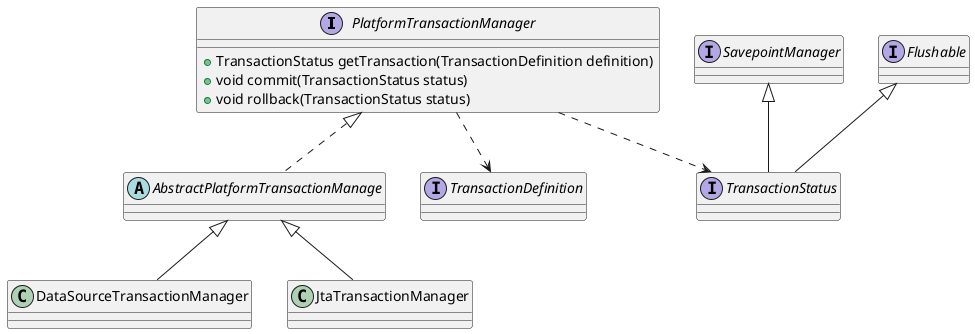

org.springframework.transaction.PlatformTransactionManager

## hierarchy
```
PlatformTransactionManager (org.springframework.transaction)
    CallbackPreferringPlatformTransactionManager (org.springframework.transaction.support)
    AbstractPlatformTransactionManager (org.springframework.transaction.support)
        CciLocalTransactionManager (org.springframework.jca.cci.connection)
        DataSourceTransactionManager (org.springframework.jdbc.datasource)
        JtaTransactionManager (org.springframework.transaction.jta)
            WebLogicJtaTransactionManager (org.springframework.transaction.jta)
            WebSphereUowTransactionManager (org.springframework.transaction.jta)
        ChainedTransactionManager (org.springframework.data.transaction)
    ResourceTransactionManager (org.springframework.transaction.support)
        CciLocalTransactionManager (org.springframework.jca.cci.connection)
        DataSourceTransactionManager (org.springframework.jdbc.datasource)
```
## define



## methods
* getTransaction
* commit
* rollback