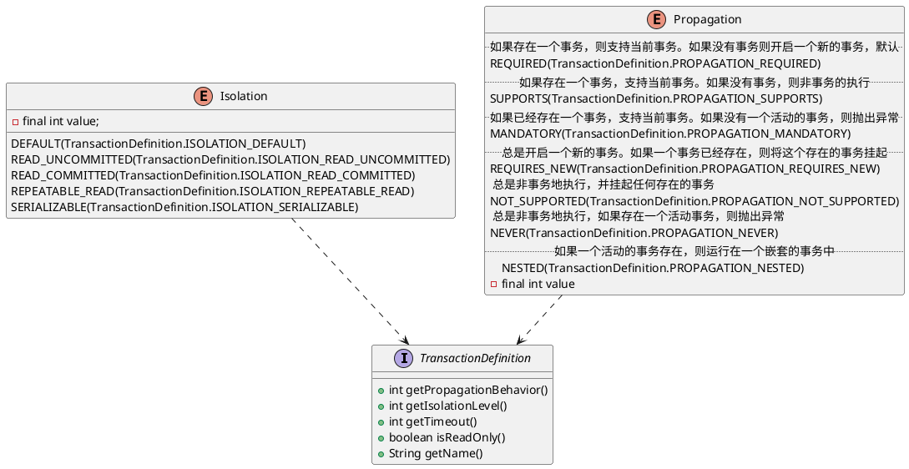

## define 

```plantuml
@startuml

interface TransactionDefinition {
    + int getPropagationBehavior()
    + int getIsolationLevel()
    + int getTimeout()
    + boolean isReadOnly()
    + String getName()
}

enum Isolation {
	DEFAULT(TransactionDefinition.ISOLATION_DEFAULT)
	READ_UNCOMMITTED(TransactionDefinition.ISOLATION_READ_UNCOMMITTED)
	READ_COMMITTED(TransactionDefinition.ISOLATION_READ_COMMITTED)
	REPEATABLE_READ(TransactionDefinition.ISOLATION_REPEATABLE_READ)
	SERIALIZABLE(TransactionDefinition.ISOLATION_SERIALIZABLE)
	- final int value;
}

enum Propagation {
	.. 如果存在一个事务，则支持当前事务。如果没有事务则开启一个新的事务，默认 ..
	REQUIRED(TransactionDefinition.PROPAGATION_REQUIRED)
	.. 如果存在一个事务，支持当前事务。如果没有事务，则非事务的执行 ..
	SUPPORTS(TransactionDefinition.PROPAGATION_SUPPORTS)
	.. 如果已经存在一个事务，支持当前事务。如果没有一个活动的事务，则抛出异常 ..
	MANDATORY(TransactionDefinition.PROPAGATION_MANDATORY)
	.. 总是开启一个新的事务。如果一个事务已经存在，则将这个存在的事务挂起 ..
	REQUIRES_NEW(TransactionDefinition.PROPAGATION_REQUIRES_NEW)
    .. 总是非事务地执行，并挂起任何存在的事务 ..
    NOT_SUPPORTED(TransactionDefinition.PROPAGATION_NOT_SUPPORTED)
	.. 总是非事务地执行，如果存在一个活动事务，则抛出异常 .. 
	NEVER(TransactionDefinition.PROPAGATION_NEVER)
	.. 如果一个活动的事务存在，则运行在一个嵌套的事务中 ..
	'' 如果没有活动事务, 则按TransactionDefinition.PROPAGATION_REQUIRED 属性执行
	NESTED(TransactionDefinition.PROPAGATION_NESTED)
	- final int value
}

Isolation ..> TransactionDefinition
Propagation ..> TransactionDefinition

@enduml
```