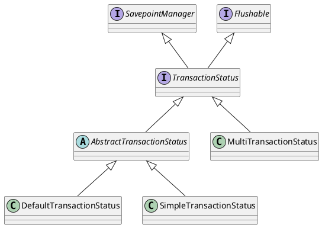

org.springframework.transaction.TransactionStatus

## hierarchy
```
TransactionStatus (org.springframework.transaction)
    Flushable (java.io)
    SavepointManager (org.springframework.transaction)
TransactionStatus (org.springframework.transaction)
    AbstractTransactionStatus (org.springframework.transaction.support)
        DefaultTransactionStatus (org.springframework.transaction.support)
        SimpleTransactionStatus (org.springframework.transaction.support)
    MultiTransactionStatus (org.springframework.data.transaction)
```
## package
