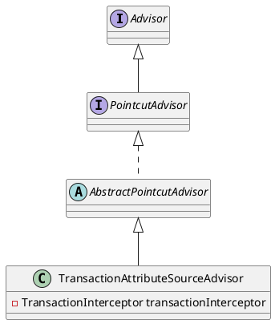

org.springframework.transaction.interceptor.TransactionAttributeSourceAdvisor

## hierarchy
```
AbstractPointcutAdvisor (org.springframework.aop.support)
    TransactionAttributeSourceAdvisor (org.springframework.transaction.interceptor)
```

## define
