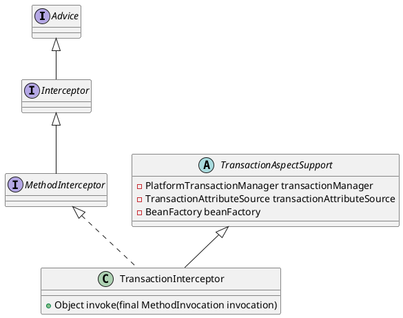

org.springframework.transaction.interceptor.TransactionInterceptor

## hierarchy
```
TransactionAspectSupport (org.springframework.transaction.interceptor)
    TransactionInterceptor (org.springframework.transaction.interceptor)
```

## define

