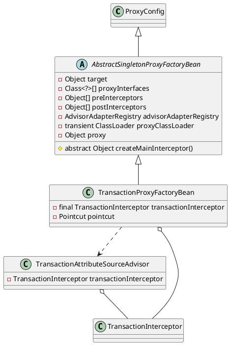

org.springframework.transaction.interceptor.TransactionProxyFactoryBean

## hierarchy
```
ProxyConfig (org.springframework.aop.framework)
    AbstractSingletonProxyFactoryBean (org.springframework.aop.framework)
        CacheProxyFactoryBean (org.springframework.cache.interceptor)
        TransactionProxyFactoryBean (org.springframework.transaction.interceptor)
    AdvisedSupport (org.springframework.aop.framework)
        ProxyCreatorSupport (org.springframework.aop.framework)
            AspectJProxyFactory (org.springframework.aop.aspectj.annotation)
            ProxyFactory (org.springframework.aop.framework)
            ProxyFactoryBean (org.springframework.aop.framework)
```

读取和处理在IoC容器中配置的事务处理属性，并转化为Spring事务处理需要的内部数据结构
org.springframework.transaction.interceptor.TransactionAttributeSourceAdvisor

## define




