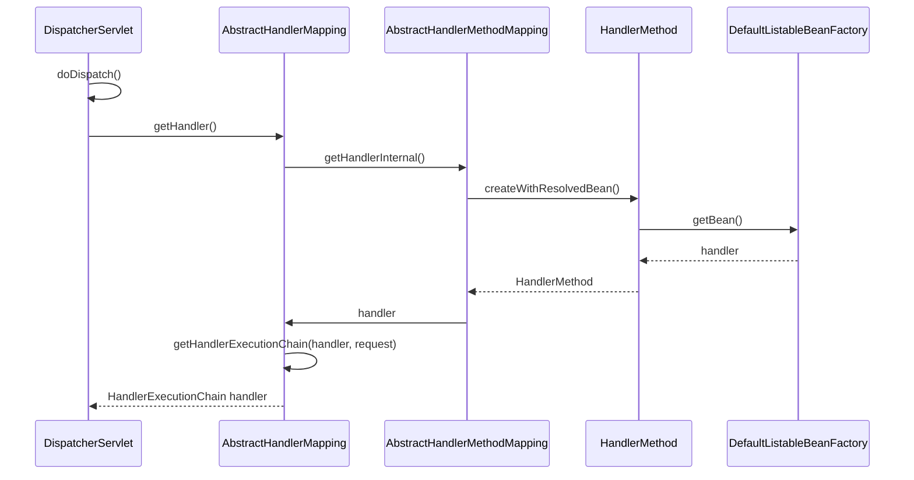

org.springframework.web.method.HandlerMethod

## 1. 定义
```
HandlerMethod
    InvocableHandlerMethod
        ServletInvocableHandlerMethod
            ConcurrentResultHandlerMethod
```

## 2. 类图



HandlerMethod及子类主要用于封装方法调用相关信息,子类还提供调用,参数准备和返回值处理的职责.

HandlerMethod 封装方法定义相关的信息,如类,方法,参数等. 使用场景:HandlerMapping时会使用
InvocableHandlerMethod 添加参数准备,方法调用功能 使用场景:执行使用@ModelAttribute注解会使用
ServletInvocableHandlerMethod 添加返回值处理职责,ResponseStatus处理 使用场景:执行http相关方法会使用,比如调用处理执行

1. HandlerMethod
HandlerMethod其实可以简单理解为保持方法信息的pojo.

2. InvocableHandlerMethod
这边添加了2个职责:参数准备和方法执行.
参数准备委托HandlerMethodArgumentResolver进行具体的解析.解析的时候需要用到WebDataBinder,所以顺便带上.

3. ServletInvocableHandlerMethod
委托HandlerMethodReturnValueHandler添加返回值处理功能
添加@ResponseStatus注解支持.

```java

    /**
	 * Invoke the method and handle the return value through one of the
	 * configured {@link HandlerMethodReturnValueHandler}s.
	 * @param webRequest the current request
	 * @param mavContainer the ModelAndViewContainer for this request
	 * @param providedArgs "given" arguments matched by type (not resolved)
	 */
	public void invokeAndHandle(ServletWebRequest webRequest, ModelAndViewContainer mavContainer,
			Object... providedArgs) throws Exception {

        // 委托父类执行请求
		Object returnValue = invokeForRequest(webRequest, mavContainer, providedArgs);
        // 添加ResponseStatus支持
		setResponseStatus(webRequest);

        // 然后判断怎么样才是执行完毕,满足一下任意一个:
　　　　//request的notModified为真,使用@ResponseStatus注解,mavContainer的requestHandled为真
		if (returnValue == null) {
			if (isRequestNotModified(webRequest) || getResponseStatus() != null || mavContainer.isRequestHandled()) {
				mavContainer.setRequestHandled(true);
				return;
			}
		}
		else if (StringUtils.hasText(getResponseStatusReason())) {
			mavContainer.setRequestHandled(true);
			return;
		}

		mavContainer.setRequestHandled(false);
		try {
            // 委托HandlerMethodReturnValueHandler封装返回值
			this.returnValueHandlers.handleReturnValue(
					returnValue, getReturnValueType(returnValue), mavContainer, webRequest);
		}
		catch (Exception ex) {
			if (logger.isTraceEnabled()) {
				logger.trace(getReturnValueHandlingErrorMessage("Error handling return value", returnValue), ex);
			}
			throw ex;
		}
	}
```

[HandlerMethod](https://www.cnblogs.com/leftthen/p/5229204.html)