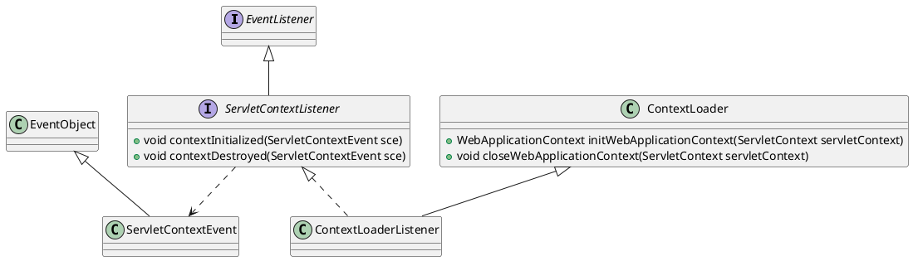
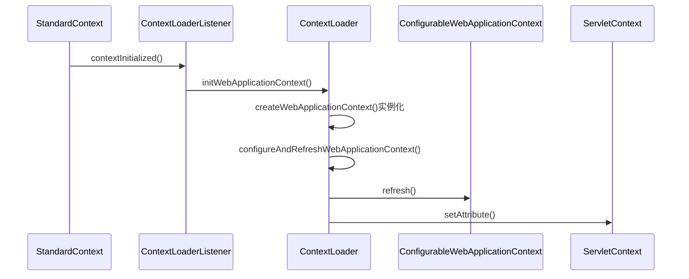
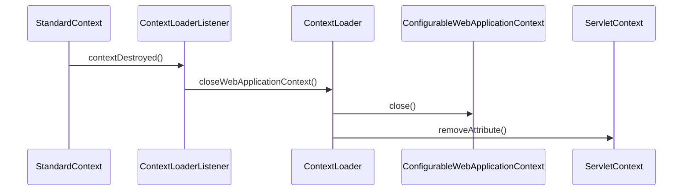

org.springframework.web.context.ContextLoader
org.springframework.web.context.ContextLoaderListener

## hierarchy
```
ContextLoader (org.springframework.web.context)
    ContextLoaderListener (org.springframework.web.context)
        1 in SpringBootServletInitializer (org.springframework.boot.web.servlet.support)
        1 in SpringBootServletInitializer (org.springframework.boot.web.support)
ContextLoaderListener (org.springframework.web.context)
    ContextLoader (org.springframework.web.context)
        Object (java.lang)
    ServletContextListener (javax.servlet)
        EventListener (java.util)
```
## define



## 启动


## 销毁



## 各种Loader
* ClassLoader 各种类加载器
* ContextLoader spring 上下文加载器
* ResourceLoader spring 资源加载器
* ServiceLoader jdk spi 加载器
* ExtensionLoader dubbo spi 加载器
* FileLoader 文件加载器
* WebappLoader web应用加载器
* SecureLoader


## start stack
* spring context
* mvc context
* context发布事件，dispatcherServlet.onRefresh

### spring context
```
refresh:507, AbstractApplicationContext (org.springframework.context.support)
configureAndRefreshWebApplicationContext:444, ContextLoader (org.springframework.web.context)
initWebApplicationContext:326, ContextLoader (org.springframework.web.context)
contextInitialized:107, ContextLoaderListener (org.springframework.web.context)

listenerStart:5099, StandardContext (org.apache.catalina.core) // listenerStart ----------------------------------------
startInternal:5615, StandardContext (org.apache.catalina.core)
start:147, LifecycleBase (org.apache.catalina.util)

addChildInternal:899, ContainerBase (org.apache.catalina.core)
addChild:875, ContainerBase (org.apache.catalina.core)
addChild:652, StandardHost (org.apache.catalina.core)
manageApp:1863, HostConfig (org.apache.catalina.startup)

invoke0:-1, NativeMethodAccessorImpl (sun.reflect)
invoke:57, NativeMethodAccessorImpl (sun.reflect)
invoke:43, DelegatingMethodAccessorImpl (sun.reflect)
invoke:606, Method (java.lang.reflect)
invoke:301, BaseModelMBean (org.apache.tomcat.util.modeler)
invoke:819, DefaultMBeanServerInterceptor (com.sun.jmx.interceptor)
invoke:801, JmxMBeanServer (com.sun.jmx.mbeanserver)

createStandardContext:618, MBeanFactory (org.apache.catalina.mbeans)
createStandardContext:565, MBeanFactory (org.apache.catalina.mbeans)
invoke0:-1, NativeMethodAccessorImpl (sun.reflect)
invoke:57, NativeMethodAccessorImpl (sun.reflect)
invoke:43, DelegatingMethodAccessorImpl (sun.reflect)
invoke:606, Method (java.lang.reflect)
invoke:301, BaseModelMBean (org.apache.tomcat.util.modeler)

invoke:819, DefaultMBeanServerInterceptor (com.sun.jmx.interceptor)
invoke:801, JmxMBeanServer (com.sun.jmx.mbeanserver)
doOperation:1487, RMIConnectionImpl (javax.management.remote.rmi)
access$300:97, RMIConnectionImpl (javax.management.remote.rmi)
run:1328, RMIConnectionImpl$PrivilegedOperation (javax.management.remote.rmi)
doPrivilegedOperation:1420, RMIConnectionImpl (javax.management.remote.rmi)
invoke:848, RMIConnectionImpl (javax.management.remote.rmi)
invoke0:-1, NativeMethodAccessorImpl (sun.reflect)
invoke:57, NativeMethodAccessorImpl (sun.reflect)
invoke:43, DelegatingMethodAccessorImpl (sun.reflect)
invoke:606, Method (java.lang.reflect)
dispatch:322, UnicastServerRef (sun.rmi.server)
run:202, Transport$2 (sun.rmi.transport)
run:199, Transport$2 (sun.rmi.transport)
doPrivileged:-1, AccessController (java.security)
serviceCall:198, Transport (sun.rmi.transport)
handleMessages:567, TCPTransport (sun.rmi.transport.tcp)
run0:828, TCPTransport$ConnectionHandler (sun.rmi.transport.tcp)
access$400:619, TCPTransport$ConnectionHandler (sun.rmi.transport.tcp)
run:684, TCPTransport$ConnectionHandler$1 (sun.rmi.transport.tcp)
run:681, TCPTransport$ConnectionHandler$1 (sun.rmi.transport.tcp)
doPrivileged:-1, AccessController (java.security)
run:681, TCPTransport$ConnectionHandler (sun.rmi.transport.tcp)
runWorker:1145, ThreadPoolExecutor (java.util.concurrent)
run:615, ThreadPoolExecutor$Worker (java.util.concurrent)
run:745, Thread (java.lang)
```

### mvc context
```
refresh:507, AbstractApplicationContext (org.springframework.context.support)
configureAndRefreshWebApplicationContext:666, FrameworkServlet (org.springframework.web.servlet)
createWebApplicationContext:632, FrameworkServlet (org.springframework.web.servlet)
createWebApplicationContext:680, FrameworkServlet (org.springframework.web.servlet)
initWebApplicationContext:551, FrameworkServlet (org.springframework.web.servlet)

initServletBean:492, FrameworkServlet (org.springframework.web.servlet)
init:136, HttpServletBean (org.springframework.web.servlet)
init:158, GenericServlet (javax.servlet)
initServlet:1282, StandardWrapper (org.apache.catalina.core)
loadServlet:1195, StandardWrapper (org.apache.catalina.core)
load:1085, StandardWrapper (org.apache.catalina.core)

loadOnStartup:5349, StandardContext (org.apache.catalina.core) // loadOnStartup ----------------------------------------
startInternal:5641, StandardContext (org.apache.catalina.core)
start:147, LifecycleBase (org.apache.catalina.util)

```

###  mvc context finish
```
initStrategies:482, DispatcherServlet (org.springframework.web.servlet)
onRefresh:474, DispatcherServlet (org.springframework.web.servlet)
onApplicationEvent:804, FrameworkServlet (org.springframework.web.servlet)
onApplicationEvent:1118, FrameworkServlet$ContextRefreshListener (org.springframework.web.servlet)
onApplicationEvent:1114, FrameworkServlet$ContextRefreshListener (org.springframework.web.servlet)
onApplicationEvent:56, GenericApplicationListenerAdapter (org.springframework.context.event)
onApplicationEventInternal:107, SourceFilteringListener (org.springframework.context.event)
onApplicationEvent:71, SourceFilteringListener (org.springframework.context.event)
invokeListener:166, SimpleApplicationEventMulticaster (org.springframework.context.event)
multicastEvent:138, SimpleApplicationEventMulticaster (org.springframework.context.event)
publishEvent:381, AbstractApplicationContext (org.springframework.context.support)
publishEvent:335, AbstractApplicationContext (org.springframework.context.support)
finishRefresh:855, AbstractApplicationContext (org.springframework.context.support)

refresh:541, AbstractApplicationContext (org.springframework.context.support)
configureAndRefreshWebApplicationContext:666, FrameworkServlet (org.springframework.web.servlet)
createWebApplicationContext:632, FrameworkServlet (org.springframework.web.servlet)
createWebApplicationContext:680, FrameworkServlet (org.springframework.web.servlet)
initWebApplicationContext:551, FrameworkServlet (org.springframework.web.servlet)
```