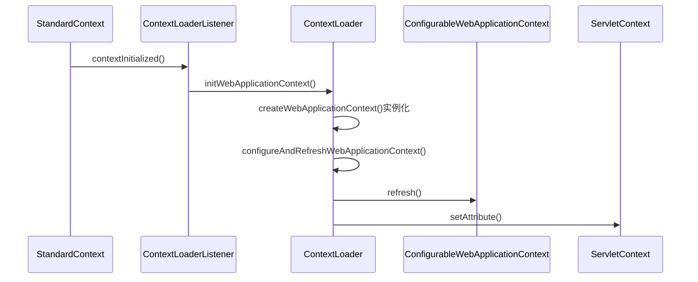
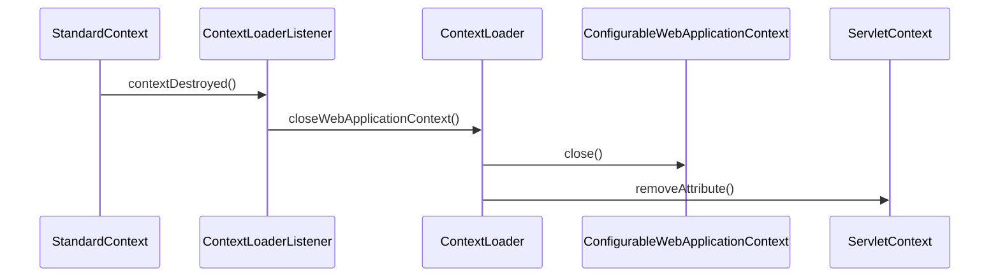

org.springframework.web.context.ContextLoaderListener

## 启动

## 销毁

## 各种Loader
* ClassLoader 各种类加载器
* ContextLoader spring 上下文加载器
* ResourceLoader spring 资源加载器
* ServiceLoader jdk spi 加载器
* ExtensionLoader dubbo spi 加载器
* FileLoader 文件加载器
* WebappLoader web应用加载器
* SecureLoader
