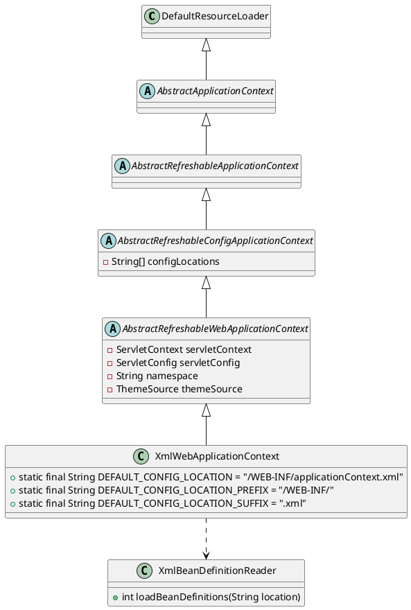

org.springframework.web.context.support.XmlWebApplicationContext

## hierarchy
```
DefaultResourceLoader (org.springframework.core.io)
    AbstractApplicationContext (org.springframework.context.support)
        AbstractRefreshableApplicationContext (org.springframework.context.support)
            AbstractRefreshableConfigApplicationContext (org.springframework.context.support)
                AbstractRefreshableWebApplicationContext (org.springframework.web.context.support)
                    XmlWebApplicationContext (org.springframework.web.context.support)
                AbstractXmlApplicationContext (org.springframework.context.support)
                    ClassPathXmlApplicationContext (org.springframework.context.support)
                    FileSystemXmlApplicationContext (org.springframework.context.support)
```

## define

* loadBeanDefinitions


