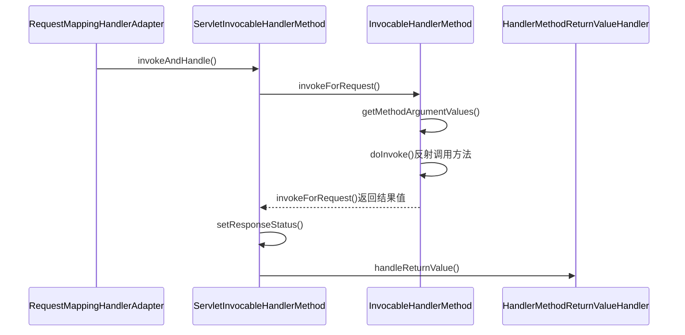

org.springframework.web.method.HandlerMethod

## 1. 定义
对处理方法的封装

```
@startuml
class HandlerMethod {
	- Object bean;
	- BeanFactory beanFactory;
	- Class<?> beanType;
	- Method method;
	- Method bridgedMethod;
	- MethodParameter[] parameters;
	- HandlerMethod resolvedFromHandlerMethod;
}

class InvocableHandlerMethod {
    + Object invokeForRequest(NativeWebRequest request, ModelAndViewContainer mavContainer,
    			Object... providedArgs)
    - Object[] getMethodArgumentValues(NativeWebRequest request, ModelAndViewContainer mavContainer,
                Object... providedArgs)
    # Object doInvoke(Object... args)
}

class ServletInvocableHandlerMethod {
    + void invokeAndHandle(ServletWebRequest webRequest, ModelAndViewContainer mavContainer,
    			Object... providedArgs)
    - void setResponseStatus(ServletWebRequest webRequest)
}

HandlerMethod <|-- InvocableHandlerMethod
InvocableHandlerMethod <|-- ServletInvocableHandlerMethod

@enduml
```
## 2. 类图
继承层次
```
HandlerMethod (org.springframework.web.method)
	InvocableHandlerMethod (org.springframework.web.method.support)
		ServletInvocableHandlerMethod (org.springframework.web.servlet.mvc.method.annotation)
			ConcurrentResultHandlerMethod in ServletInvocableHandlerMethod (org.springframework.web.servlet.mvc.method.annotation)
```

## 3. ServletInvocableHandlerMethod.invokeAndHandle()

* ServletInvocableHandlerMethod
* InvocableHandlerMethod
* HandlerMethod




## blog

HandlerMethod及子类主要用于封装方法调用相关信息,子类还提供调用,参数准备和返回值处理的职责.

HandlerMethod 封装方法定义相关的信息,如类,方法,参数等. 使用场景:HandlerMapping时会使用
InvocableHandlerMethod 添加参数准备,方法调用功能 使用场景:执行使用@ModelAttribute注解会使用
ServletInvocableHandlerMethod 添加返回值处理职责,ResponseStatus处理 使用场景:执行http相关方法会使用,比如调用处理执行

1. HandlerMethod
HandlerMethod其实可以简单理解为保持方法信息的pojo.

2. InvocableHandlerMethod
这边添加了2个职责:参数准备和方法执行.
参数准备委托HandlerMethodArgumentResolver进行具体的解析.解析的时候需要用到WebDataBinder,所以顺便带上.

3. ServletInvocableHandlerMethod
委托HandlerMethodReturnValueHandler添加返回值处理功能
添加@ResponseStatus注解支持.


[HandlerMethod](https://www.cnblogs.com/leftthen/p/5229204.html)