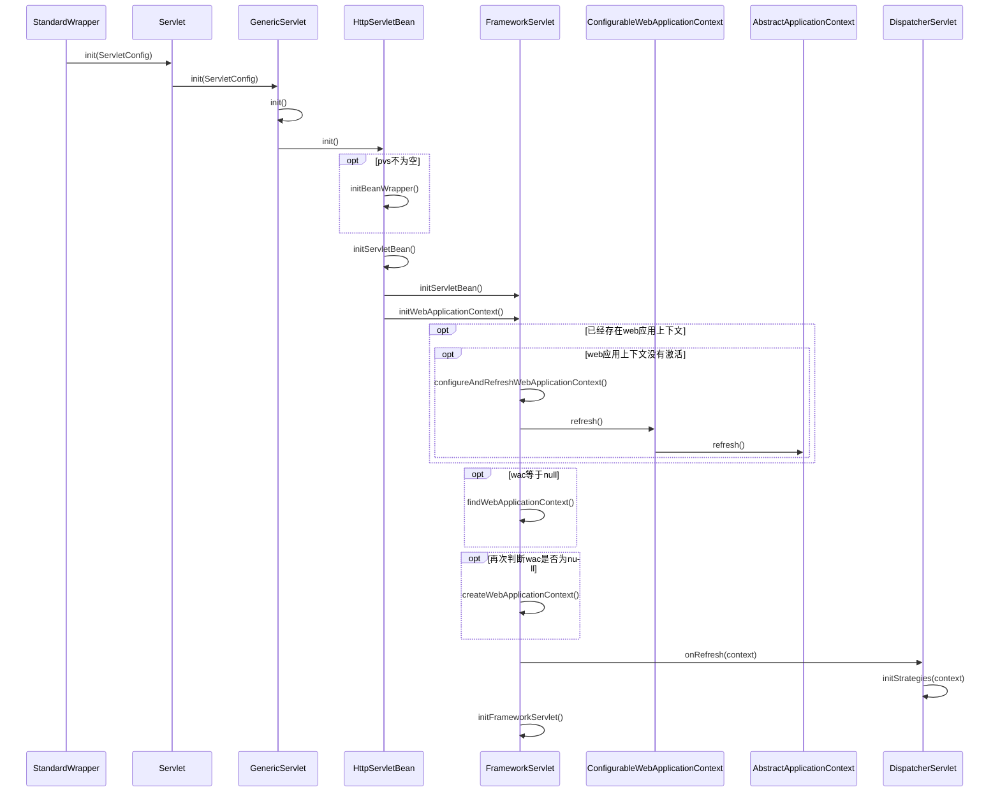
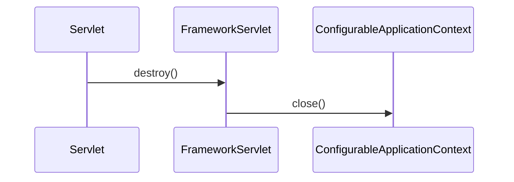
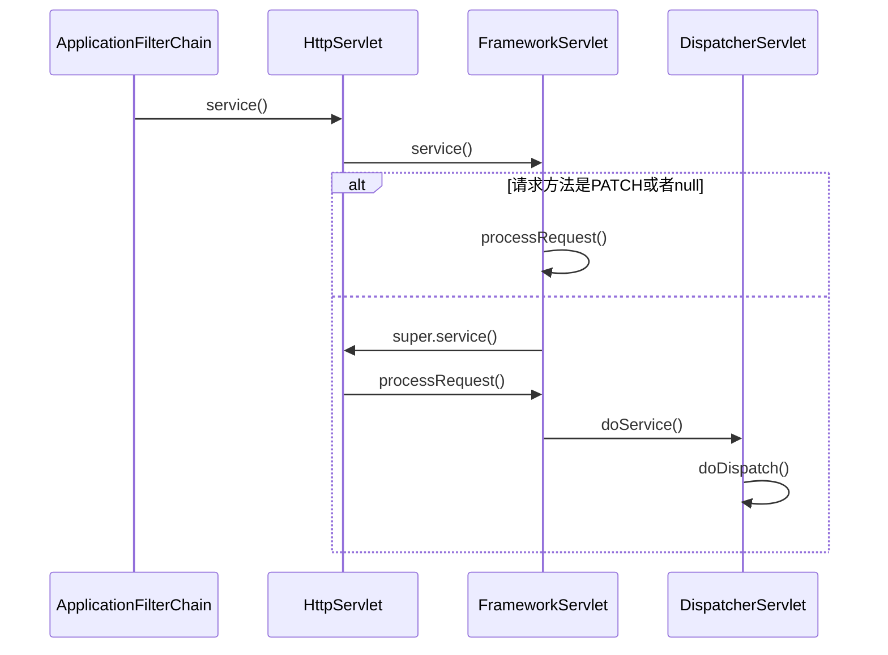
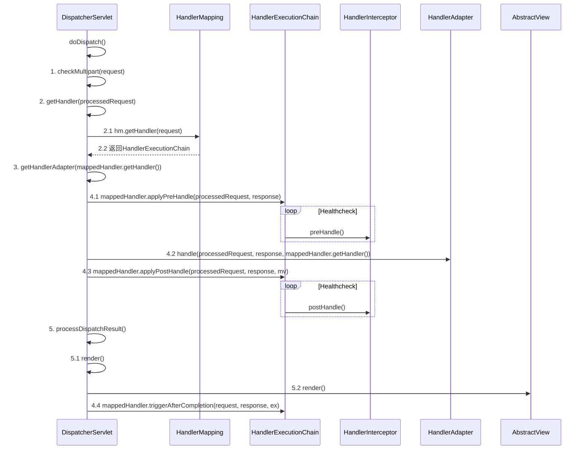

* org.springframework.web.servlet.HttpServletBean
* org.springframework.web.servlet.FrameworkServlet
* org.springframework.web.servlet.DispatcherServlet

## hierarchy
DispatcherServlet通过继承FrameworkServlet和HttpServletBean而继承HttpServlet，通过使用Servlet API来对HTTP请求进行响应，
成为Spring MVC的前端处理器，同时成为MVC模块与Web容器集成的处理前端。

```yuml

// {type:class}

// servlet api
[Servlet{bg:thistle}]
[GenericServlet{bg:thistle}]
[HttpServlet{bg:thistle}]

// springmvc
[HttpServletBean{bg:wheat}]
[FrameworkServlet{bg:wheat}]
[DispatcherServlet{bg:tomato}]

// 请求处理
[HandlerMapping{bg:slategray}]
[HandlerAdapter{bg:slategray}]
[HandlerExceptionResolver{bg:slategray}]
[ViewResolver{bg:slategray}]

// 1. servlet规范
[Servlet]^-.-[GenericServlet]
[ServletConfig]^-.-[GenericServlet]
[GenericServlet]^-[HttpServlet]

// 2. HttpServletBean
[HttpServlet]^-[HttpServletBean]
// EnvironmentCapable 对get方法抽象
[EnvironmentCapable]^-.-[HttpServletBean]
// EnvironmentAware 对set方法抽象
[EnvironmentAware]^-.-[HttpServletBean]

// 3. FrameworkServlet
[HttpServletBean]^-[FrameworkServlet]
[ApplicationContextAware]^-.-[FrameworkServlet]

// 4. DispatcherServlet
[FrameworkServlet]^-[DispatcherServlet]

// 4.1 特性 multipart解析器
[DispatcherServlet]++-[MultipartResolver]
[DispatcherServlet]++-[LocaleResolver]
[DispatcherServlet]++-[ThemeResolver]

// 4.2 请求映射处理
[DispatcherServlet]++1-*[HandlerMapping]
[DispatcherServlet]++1-*[HandlerAdapter]
[DispatcherServlet]++1-*[HandlerExceptionResolver]

// 4.3 视图处理
[DispatcherServlet]++-[RequestToViewNameTranslator]
[DispatcherServlet]++-[FlashMapManager]
[DispatcherServlet]++1-*[ViewResolver]

```

## define
* 静态域
* 实例域
* 实例方法
  * 初始化 onRefresh, initStrategies
  * 服务方法 doService
  * 分发请求 doDispatch

```plantuml
@startuml

abstract class FrameworkServlet

'''''''''''''''''''''''''' 分配器(调度程序)小服务程序 ''''''''''''''''''''''''''
class DispatcherServlet {
    - MultipartResolver multipartResolver
    - LocaleResolver localeResolver
    - ThemeResolver themeResolver
    - List<HandlerMapping> handlerMappings
    - List<HandlerAdapter> handlerAdapters
    - List<HandlerExceptionResolver> handlerExceptionResolvers
    - RequestToViewNameTranslator viewNameTranslator
    - FlashMapManager flashMapManager
	- List<ViewResolver> viewResolvers
	.. 初始化方法 ..
	# void onRefresh(ApplicationContext context)
	# void initStrategies(ApplicationContext context)
	.. 服务方法 ..
	# void doService(HttpServletRequest request, HttpServletResponse response) 
	.. 分发请求方法 ..
    # void doDispatch(HttpServletRequest request, HttpServletResponse response)
    # HttpServletRequest checkMultipart(HttpServletRequest request)
    # HandlerExecutionChain getHandler(HttpServletRequest request)
    # HandlerAdapter getHandlerAdapter(Object handler)
    - void applyDefaultViewName(HttpServletRequest request, ModelAndView mv)
    - void processDispatchResult(HttpServletRequest request, HttpServletResponse response,
        HandlerExecutionChain mappedHandler, ModelAndView mv, Exception exception) 
    # void render(ModelAndView mv, HttpServletRequest request, HttpServletResponse response) 
}
FrameworkServlet <|-- DispatcherServlet

'''''''''''''''''''''''''' 处理器映射器 ''''''''''''''''''''''''''
interface HandlerMapping { 
    + HandlerExecutionChain getHandler(HttpServletRequest request)
}
DispatcherServlet o-- HandlerMapping

'''''''''''''''''''''''''' 处理器执行链 ''''''''''''''''''''''''''
class HandlerExecutionChain { 
    - final Object handler
    - HandlerInterceptor[] interceptors
    boolean applyPreHandle(HttpServletRequest request, HttpServletResponse response)
    void applyPostHandle(HttpServletRequest request, HttpServletResponse response, ModelAndView mv)
    void triggerAfterCompletion(HttpServletRequest request, HttpServletResponse response, Exception ex)
}

'''''''''''''''''''''''''' 处理器执行链-拦截器 ''''''''''''''''''''''''''
interface HandlerInterceptor {
    + boolean preHandle(HttpServletRequest request, HttpServletResponse response, Object handler)
    + void postHandle(HttpServletRequest request, HttpServletResponse response, Object handler,
    			ModelAndView modelAndView)
    + void afterCompletion(HttpServletRequest request, HttpServletResponse response, Object handler,
   			 Exception ex)  			
}
DispatcherServlet ..> HandlerExecutionChain
HandlerExecutionChain o-- HandlerInterceptor

'''''''''''''''''''''''''' 处理器适配器 ''''''''''''''''''''''''''
interface HandlerAdapter {
    + boolean supports(Object handler)
    + ModelAndView handle(HttpServletRequest request, HttpServletResponse response, Object handler) 
}

DispatcherServlet o-- HandlerAdapter

'''''''''''''''''''''''''' 视图解析器 ''''''''''''''''''''''''''
interface ViewResolver {
	+ View resolveViewName(String viewName, Locale locale)
}
DispatcherServlet o-- ViewResolver

'''''''''''''''''''''''''' 视图 ''''''''''''''''''''''''''
interface View {
    + void render(Map<String, ?> model, HttpServletRequest request, HttpServletResponse response)
}
DispatcherServlet ..> View

class ModelAndView {
    - Object view
    - ModelMap model
}
DispatcherServlet ..> ModelAndView

@enduml
```



## 初始化 init()
第一次请求Servlet时，初始化



## 销毁 destroy()



## 处理请求 service()
* Servlet HttpServlet FrameworkServlet DispatcherServlet
* HandlerMapping HandlerExecutionChain HandlerAdapter
* HandlerAdapter

### 请求经由Servlet最终到达DispatcherServlet


### DispatcherServlet.doDispatch()
1. 媒体类型检查
2. 获取请求处理器执行链 HandlerExecutionChain
3. 获取处理器适配器 HandlerAdapter
4. 拦截器链
   1. 拦截器链，前置处理
   2. 处理器适配器处理请求
   3. 拦截器链，后置处理
5. 处理分发的结果，视图解析
6. 拦截器链，完成处理




### HandlerAdapter.handle()

[handle](./HandlerAdapter.md)
