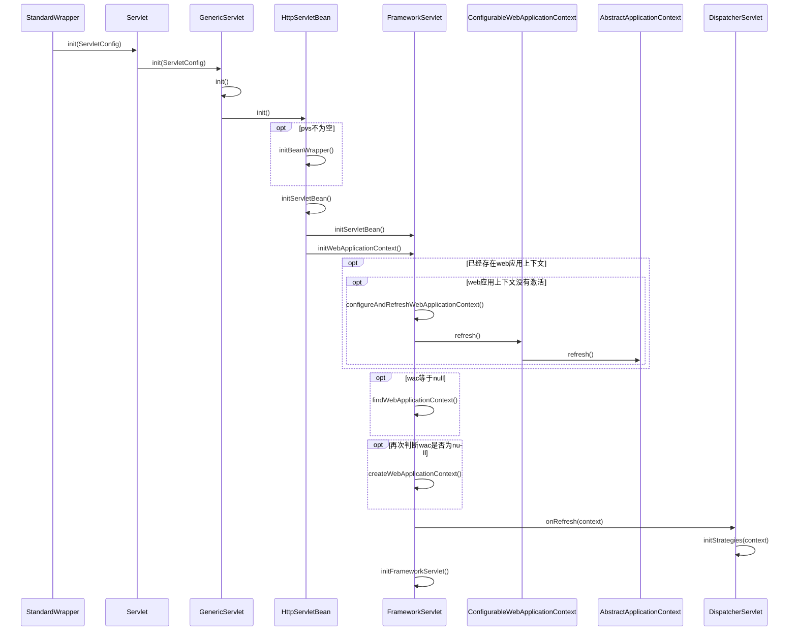
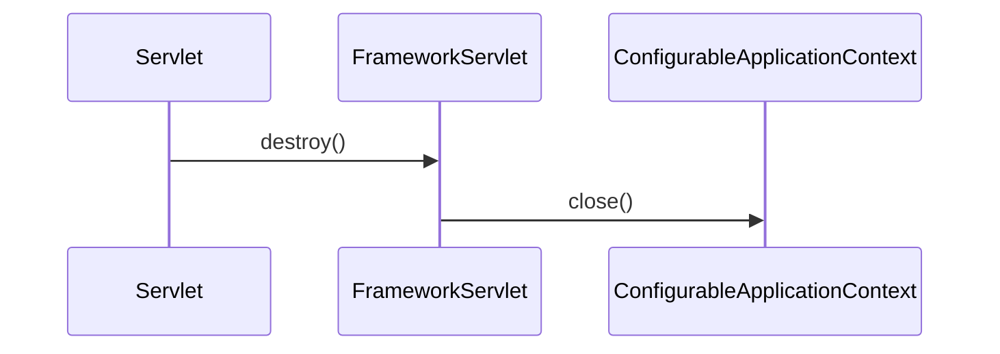
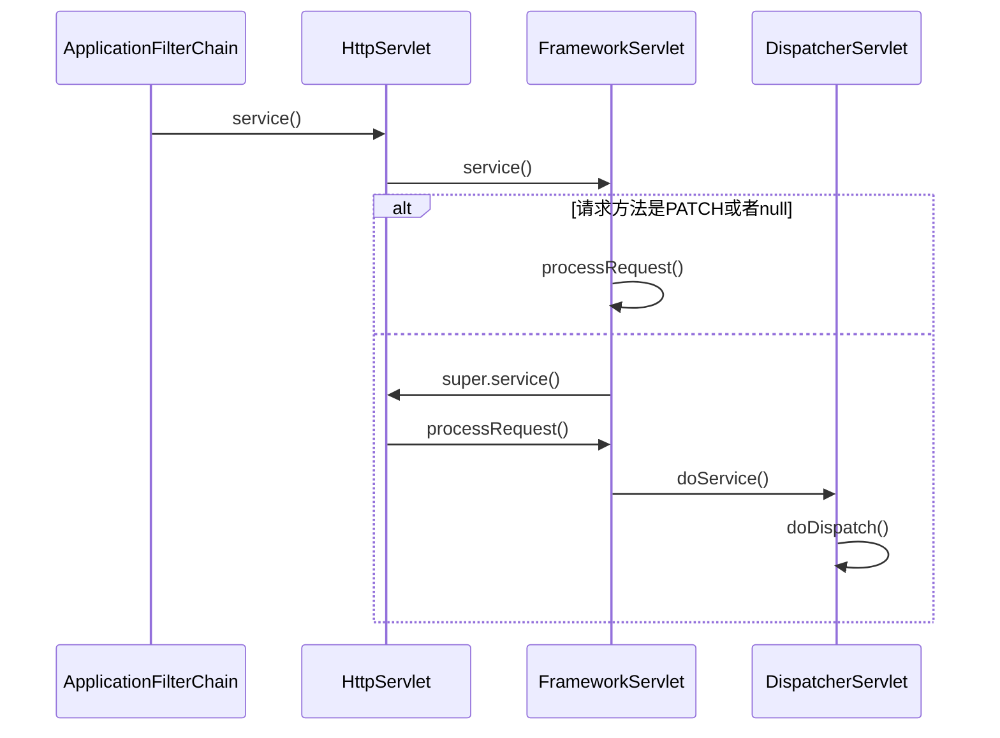
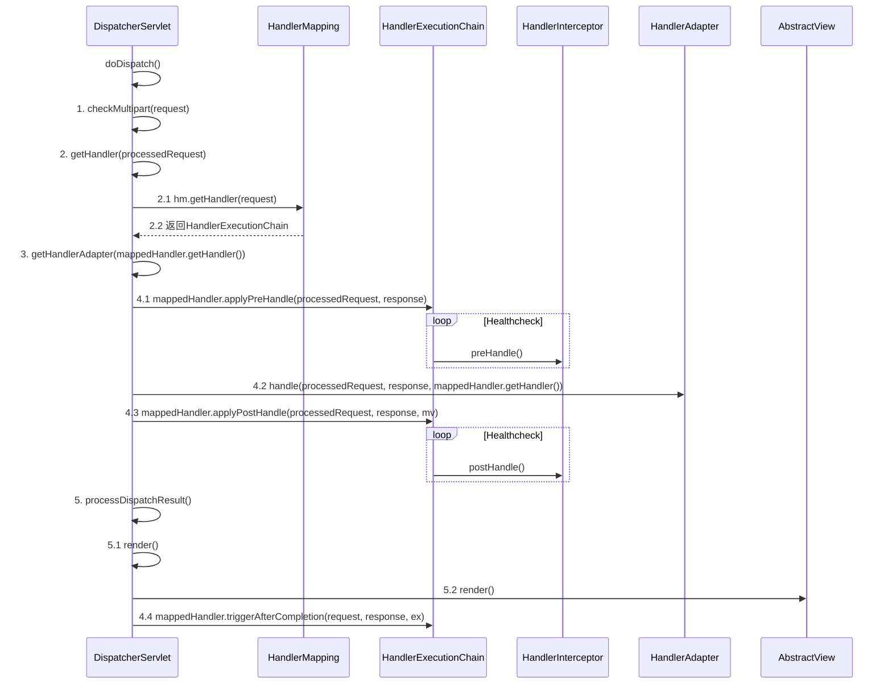

org.springframework.web.servlet.HttpServletBean
org.springframework.web.servlet.FrameworkServlet
org.springframework.web.servlet.DispatcherServlet

## 1. 类图
DispatcherServlet通过继承FrameworkServlet和HttpServletBean而继承HttpServlet，通过使用Servlet API来对HTTP请求进行响应，
成为Spring MVC的前端处理器，同时成为MVC模块与Web容器集成的处理前端。

```yuml

// {type:class}

// servlet api
[Servlet{bg:thistle}]
[GenericServlet{bg:thistle}]
[HttpServlet{bg:thistle}]

// springmvc
[HttpServletBean{bg:wheat}]
[FrameworkServlet{bg:wheat}]
[DispatcherServlet{bg:tomato}]

// 请求处理
[HandlerMapping{bg:slategray}]
[HandlerAdapter{bg:slategray}]
[HandlerExceptionResolver{bg:slategray}]
[ViewResolver{bg:slategray}]

// 1. servlet规范
[Servlet]^-.-[GenericServlet]
[ServletConfig]^-.-[GenericServlet]
[GenericServlet]^-[HttpServlet]

// 2. HttpServletBean
[HttpServlet]^-[HttpServletBean]
// EnvironmentCapable 对get方法抽象
[EnvironmentCapable]^-.-[HttpServletBean]
// EnvironmentAware 对set方法抽象
[EnvironmentAware]^-.-[HttpServletBean]

// 3. FrameworkServlet
[HttpServletBean]^-[FrameworkServlet]
[ApplicationContextAware]^-.-[FrameworkServlet]

// 4. DispatcherServlet
[FrameworkServlet]^-[DispatcherServlet]

// 4.1 特性 multipart解析器
[DispatcherServlet]++-[MultipartResolver]
[DispatcherServlet]++-[LocaleResolver]
[DispatcherServlet]++-[ThemeResolver]

// 4.2 请求映射处理
[DispatcherServlet]++1-*[HandlerMapping]
[DispatcherServlet]++1-*[HandlerAdapter]
[DispatcherServlet]++1-*[HandlerExceptionResolver]

// 4.3 视图处理
[DispatcherServlet]++-[RequestToViewNameTranslator]
[DispatcherServlet]++-[FlashMapManager]
[DispatcherServlet]++1-*[ViewResolver]

```

## 2. 初始化 init()
第一次请求Servlet时，初始化



## 3. 销毁 destroy()



## 4. 处理请求 service()

### 4.1 请求经由Servlet最终到达DispatcherServlet


### 4.2 DispatcherServlet.doDispatch()
* 请求映射
* 拦截器链
* 处理器适配器处理请求，之前、之后、完成
* 请求结果渲染视图


