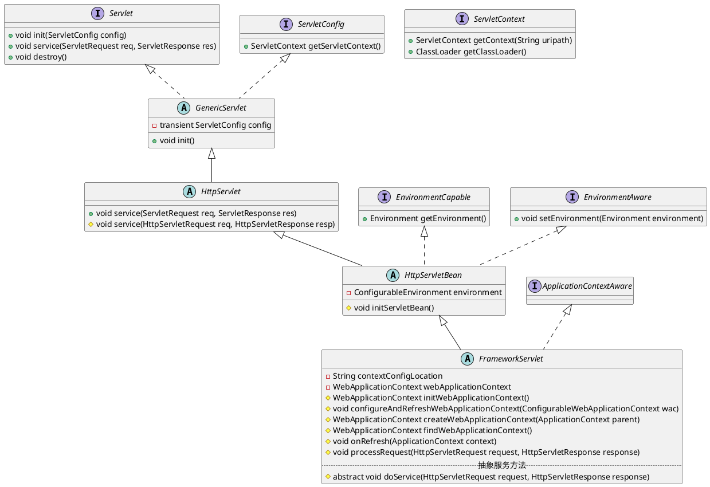

org.springframework.web.servlet.FrameworkServlet

## hierachy
```
GenericServlet (javax.servlet)
    HttpServlet (javax.servlet.http)
        HttpServletBean (org.springframework.web.servlet)
            FrameworkServlet (org.springframework.web.servlet)
                DispatcherServlet (org.springframework.web.servlet)
```

## define
* 内部类
* 静态域
* 实例域
* 实例方法
  * processRequest()
  * doService()

