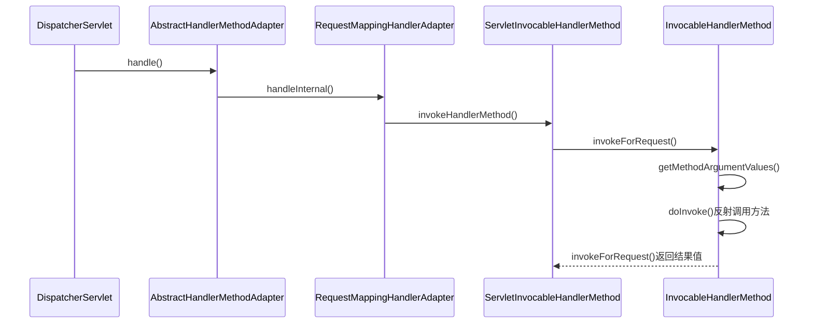

org.springframework.web.servlet.HandlerAdapter

## define
```java
public interface HandlerAdapter {
	boolean supports(Object handler);
	ModelAndView handle(HttpServletRequest request, HttpServletResponse response, Object handler) throws Exception;
	long getLastModified(HttpServletRequest request, Object handler);
}
```
## package
```
HandlerAdapter (org.springframework.web.servlet)
    HttpRequestHandlerAdapter (org.springframework.web.servlet.mvc)
    SimpleServletHandlerAdapter (org.springframework.web.servlet.handler)
    AnnotationMethodHandlerAdapter (org.springframework.web.servlet.mvc.annotation)
    AbstractHandlerMethodAdapter (org.springframework.web.servlet.mvc.method)
        RequestMappingHandlerAdapter (org.springframework.web.servlet.mvc.method.annotation)
    SimpleControllerHandlerAdapter (org.springframework.web.servlet.mvc)
```


## RequestMappingHandlerAdapter.handle()



## ServletInvocableHandlerMethod.invokeHandlerMethod()

[ServletInvocableHandlerMethod](../spring-web/HandlerMethod.md)