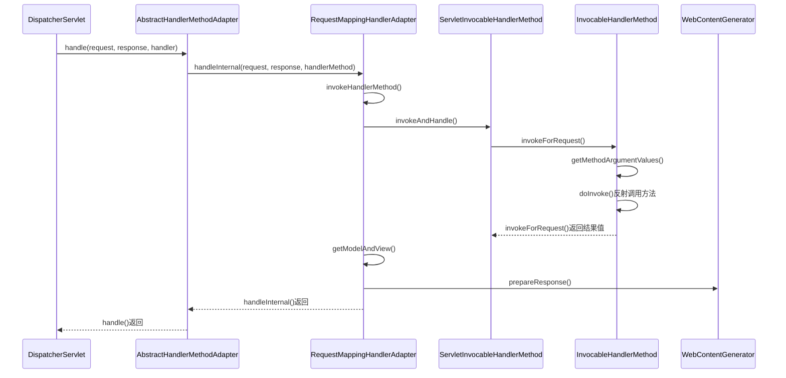

org.springframework.web.servlet.HandlerAdapter
org.springframework.web.servlet.mvc.method.AbstractHandlerMethodAdapter
org.springframework.web.servlet.mvc.method.annotation.RequestMappingHandlerAdapter
## define
```
@startuml
interface HandlerAdapter {
    + boolean supports(Object handler)
    + ModelAndView handle(HttpServletRequest request, HttpServletResponse response, Object handler) throws Exception
    + long getLastModified(HttpServletRequest request, Object handler)
}

abstract class AbstractHandlerMethodAdapter {

}
HandlerAdapter <|.. AbstractHandlerMethodAdapter

class RequestMappingHandlerAdapter {

}
AbstractHandlerMethodAdapter <|-- RequestMappingHandlerAdapter

@enduml
```
## package
```
HandlerAdapter (org.springframework.web.servlet)
    HttpRequestHandlerAdapter (org.springframework.web.servlet.mvc)
    SimpleServletHandlerAdapter (org.springframework.web.servlet.handler)
    AnnotationMethodHandlerAdapter (org.springframework.web.servlet.mvc.annotation)
    AbstractHandlerMethodAdapter (org.springframework.web.servlet.mvc.method)
        RequestMappingHandlerAdapter (org.springframework.web.servlet.mvc.method.annotation)
    SimpleControllerHandlerAdapter (org.springframework.web.servlet.mvc)
```

## RequestMappingHandlerAdapter


## RequestMappingHandlerAdapter.handle()
* 适配器处理
* 委托InvocableHandlerMethod
* 获得模型视图对象


## ServletInvocableHandlerMethod.invokeHandlerMethod()

[ServletInvocableHandlerMethod](../spring-web/web/method/HandlerMethod.md)