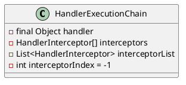

org.springframework.web.servlet.HandlerExecutionChain

## define
处理器执行链，持有拦截器的集合。

```plantuml
@startuml

class HandlerExecutionChain {
	- final Object handler
	- HandlerInterceptor[] interceptors
	- List<HandlerInterceptor> interceptorList
	- int interceptorIndex = -1
}

@enduml
```

