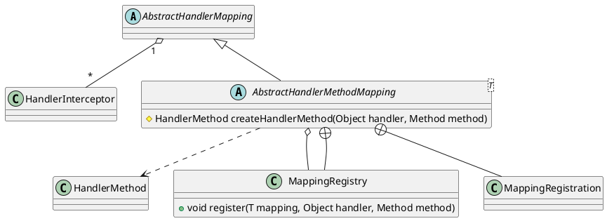

org.springframework.web.servlet.handler.AbstractHandlerMethodMapping

## hierarchy
```
ApplicationObjectSupport (org.springframework.context.support)
    WebApplicationObjectSupport (org.springframework.web.context.support)
        AbstractHandlerMapping (org.springframework.web.servlet.handler)
            AbstractHandlerMethodMapping (org.springframework.web.servlet.handler)
                RequestMappingInfoHandlerMapping (org.springframework.web.servlet.mvc.method)
                    RequestMappingHandlerMapping (org.springframework.web.servlet.mvc.method.annotation)
AbstractHandlerMethodMapping (org.springframework.web.servlet.handler)
    AbstractHandlerMapping (org.springframework.web.servlet.handler)
        HandlerMapping (org.springframework.web.servlet)
        Ordered (org.springframework.core)
        WebApplicationObjectSupport (org.springframework.web.context.support)
            ApplicationObjectSupport (org.springframework.context.support)
                ApplicationContextAware (org.springframework.context)
                    Aware (org.springframework.beans.factory)
            ServletContextAware (org.springframework.web.context)
                Aware (org.springframework.beans.factory)
    InitializingBean (org.springframework.beans.factory)
```

## define



## methods
initHandlerMethods()

protected void detectHandlerMethods(final Object handler)

MappingRegistry.register(T mapping, Object handler, Method method)
