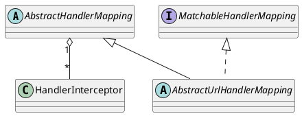

org.springframework.web.servlet.handler.AbstractUrlHandlerMapping

## hierarchy
```
ApplicationObjectSupport (org.springframework.context.support)
    WebApplicationObjectSupport (org.springframework.web.context.support)
        AbstractHandlerMapping (org.springframework.web.servlet.handler)
            AbstractUrlHandlerMapping (org.springframework.web.servlet.handler)
                AbstractDetectingUrlHandlerMapping (org.springframework.web.servlet.handler)
                    AbstractControllerUrlHandlerMapping (org.springframework.web.servlet.mvc.support)
                    ControllerBeanNameHandlerMapping (org.springframework.web.servlet.mvc.support)
                    ControllerClassNameHandlerMapping (org.springframework.web.servlet.mvc.support)
                    BeanNameUrlHandlerMapping (org.springframework.web.servlet.handler)
                    DefaultAnnotationHandlerMapping (org.springframework.web.servlet.mvc.annotation)
                SimpleUrlHandlerMapping (org.springframework.web.servlet.handler)
                WelcomePageHandlerMapping (org.springframework.boot.autoconfigure.web.servlet)
                WelcomePageHandlerMapping in WebMvcAutoConfiguration (org.springframework.boot.autoconfigure.web)
            AbstractHandlerMethodMapping
```

## define


