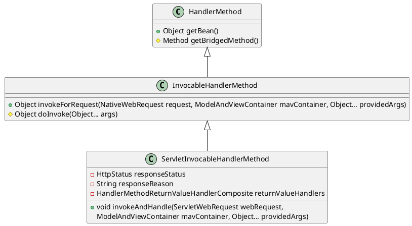

org.springframework.web.servlet.mvc.method.annotation.ServletInvocableHandlerMethod

## hierarchy
* [HandlerMethod](/20-framework/src/spring/spring-web/web/method/HandlerMethod.md)
* [InvocableHandlerMethod](/20-framework/src/spring/spring-web/web/method/support/InvocableHandlerMethod.md)
```
HandlerMethod (org.springframework.web.method)
    InvocableHandlerMethod (org.springframework.web.method.support)
        ServletInvocableHandlerMethod (org.springframework.web.servlet.mvc.method.annotation)
```

## define

