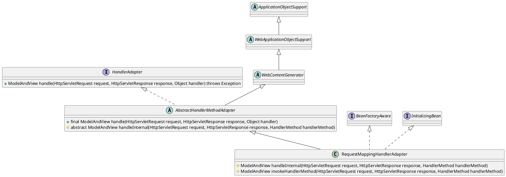

org.springframework.web.servlet.mvc.method.annotation.RequestMappingHandlerAdapter

## hierarchy
```
ApplicationObjectSupport (org.springframework.context.support)
    WebApplicationObjectSupport (org.springframework.web.context.support)
        WebContentGenerator (org.springframework.web.servlet.support)
            AbstractHandlerMethodAdapter (org.springframework.web.servlet.mvc.method)
                RequestMappingHandlerAdapter (org.springframework.web.servlet.mvc.method.annotation)
```

## define

