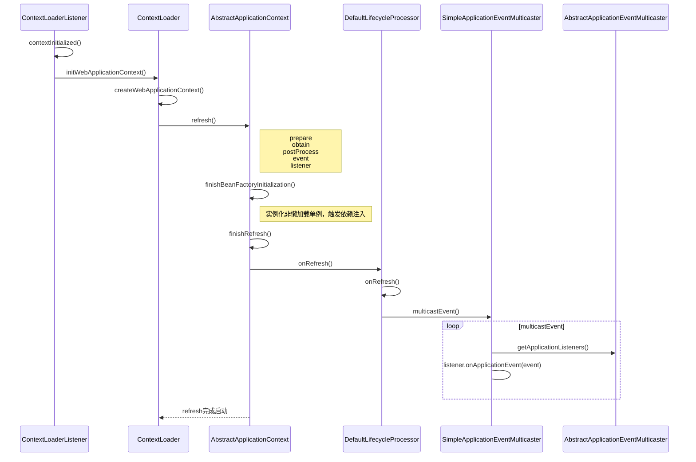
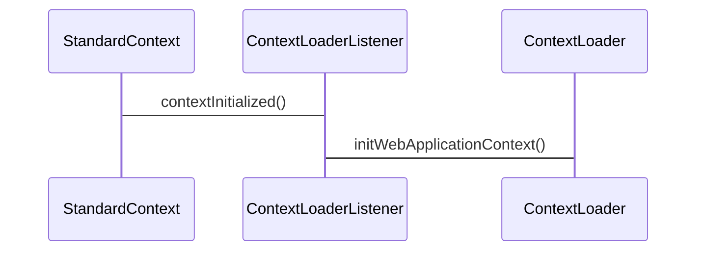
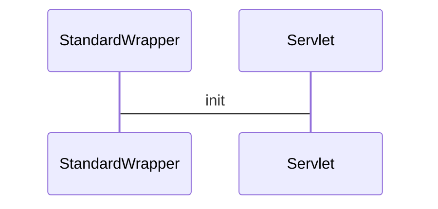

ContextLoader
    ContextLoaderListener

```mermaid
sequenceDiagram
    %% 环境监听
    ContextLoaderListener ->> ContextLoaderListener: contextInitialized()
    ContextLoaderListener ->> ContextLoader: initWebApplicationContext()

    %% 创建应用环境
    ContextLoader ->> ContextLoader: createWebApplicationContext()
    ContextLoader ->> AbstractApplicationContext: refresh()
    Note right of AbstractApplicationContext: prepare <br/>obtain <br/>postProcess <br/>event <br/>listener

    %% 依赖注入
    AbstractApplicationContext ->> AbstractApplicationContext: finishBeanFactoryInitialization()
    Note right of AbstractApplicationContext: 实例化非懒加载单例，触发依赖注入

    %% 完成刷新
    AbstractApplicationContext ->> AbstractApplicationContext: finishRefresh()

    AbstractApplicationContext ->> DefaultLifecycleProcessor: onRefresh()
    DefaultLifecycleProcessor ->> DefaultLifecycleProcessor: onRefresh()

    %% 发布事件
    DefaultLifecycleProcessor ->> SimpleApplicationEventMulticaster: multicastEvent()
    loop multicastEvent
        SimpleApplicationEventMulticaster->>AbstractApplicationEventMulticaster:getApplicationListeners()
        SimpleApplicationEventMulticaster->SimpleApplicationEventMulticaster:listener.onApplicationEvent(event)
　　 end

    AbstractApplicationContext-->>ContextLoader:refresh完成启动
```

Tomcat, spring

```mermaid
sequenceDiagram
    StandardContext->ContextLoaderListener:contextInitialized()
    ContextLoaderListener->ContextLoader:initWebApplicationContext()
```

```mermaid
sequenceDiagram
    StandardWrapper->Servlet:init
```