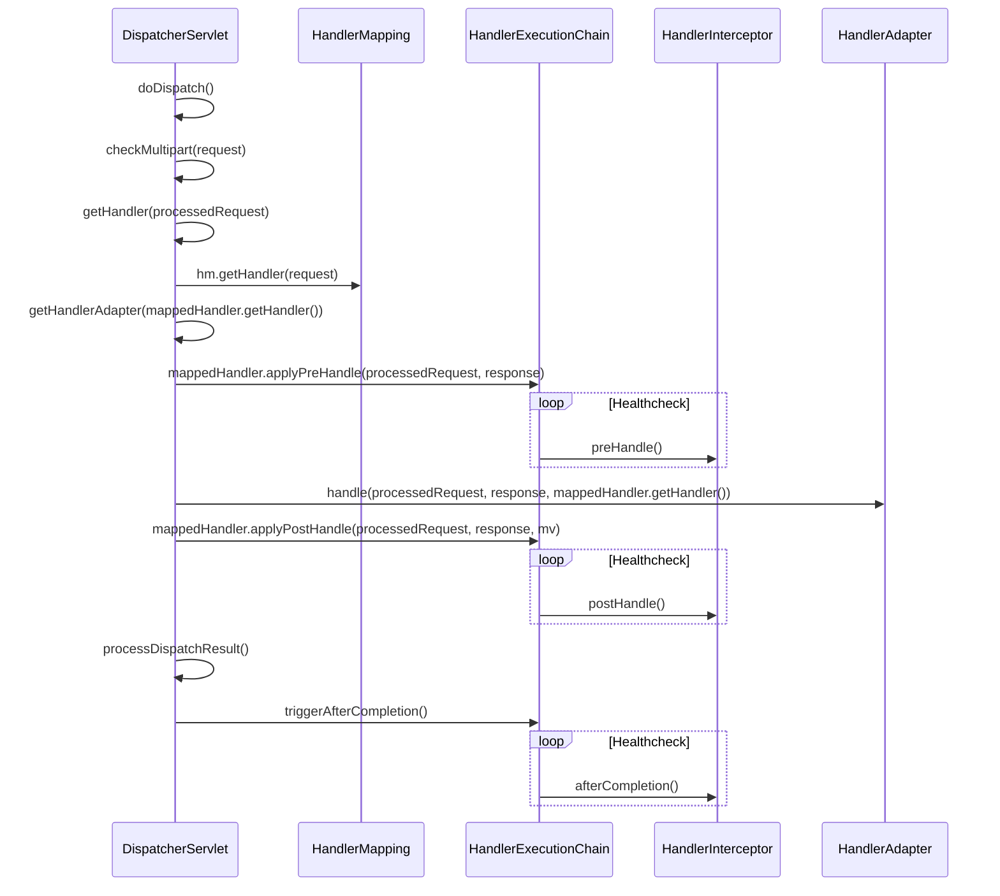
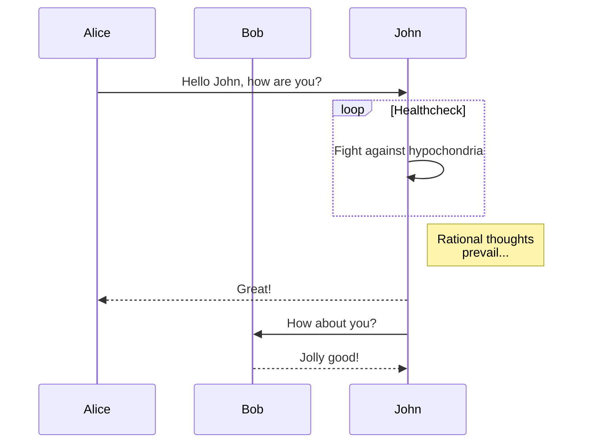

org.springframework.web.servlet.DispatcherServlet

```
javax.servletGenericServlet implements Servlet, ServletConfig, Serializable
    javax.servlet.http.HttpServlet
        HttpServletBean implements EnvironmentCapable, EnvironmentAware
            FrameworkServlet implements ApplicationContextAware
                DispatcherServlet
```

DispatcherServlet通过继承FrameworkServlet和HttpServletBean而继承HttpServlet，通过使用Servlet API来对HTTP请求进行响应，
成为Spring MVC的前端处理器，同时成为MVC模块与Web容器集成的处理前端。


### 初始化、销毁

```java

// servlet
servlet.init();

// httpServlet
httpServlet.init(); 
httpServlet.initServletBean();

// frameworkServlet
frameworkServlet.initServletBean(); 
frameworkServlet.initWebApplicationContext(); 
frameworkServlet.initFrameworkServlet();

frameworkServlet.onApplicationEvent(ContextRefreshedEvent event); 
frameworkServlet.onRefresh(ApplicationContext context);

// dispatcherServlet
dispatcherServlet.onRefresh(ApplicationContext context);
dispatcherServlet.initStrategies(ApplicationContext context);

// destroy
servlet.destroy();
frameworkServlet.destroy();

```

```java

    // DispatcherServlet
    protected void initStrategies(ApplicationContext context) {
		initMultipartResolver(context);
		initLocaleResolver(context);
		initThemeResolver(context);
		initHandlerMappings(context);
		initHandlerAdapters(context);
		initHandlerExceptionResolvers(context);
		initRequestToViewNameTranslator(context);
		initViewResolvers(context);
		initFlashMapManager(context);
	}

    // frameworkServlet
    public void destroy() {
		getServletContext().log("Destroying Spring FrameworkServlet '" + getServletName() + "'");
		// Only call close() on WebApplicationContext if locally managed...
		if (this.webApplicationContext instanceof ConfigurableApplicationContext && !this.webApplicationContextInjected) {
			((ConfigurableApplicationContext) this.webApplicationContext).close();
		}
	}

```

### 处理http分发请求
一般每一个handlerMapping可以持有一系列从URL请求到Controller的映射，而Spring MVC提供了一系列的HandlerMapping实现。


```java

servlet.service(ServletRequest req, ServletResponse res) throws ServletException, IOException

httpServlet.service(ServletRequest req, ServletResponse res) throws ServletException, IOException
httpServlet.service(HttpServletRequest req, HttpServletResponse resp) throws ServletException, IOException

doGet(req, resp);
doHead(req, resp);
doPost(req, resp);
doPut(req, resp);
doDelete(req, resp);
doOptions(req,resp);
doTrace(req,resp);

frameworkServlet.processRequest(request, response);
frameworkServlet.doService(HttpServletRequest request, HttpServletResponse response) throws Exception

dispatcherServlet.doService(HttpServletRequest request, HttpServletResponse response) throws Exception
dispatcherServlet.doDispatch(HttpServletRequest request, HttpServletResponse response) throws Exception 

```





