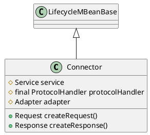

org.apache.catalina.connector.Connector

## hierarchy
```
LifecycleBase (org.apache.catalina.util)
    LifecycleMBeanBase (org.apache.catalina.util)
        Connector (org.apache.catalina.connector)
```

## define
