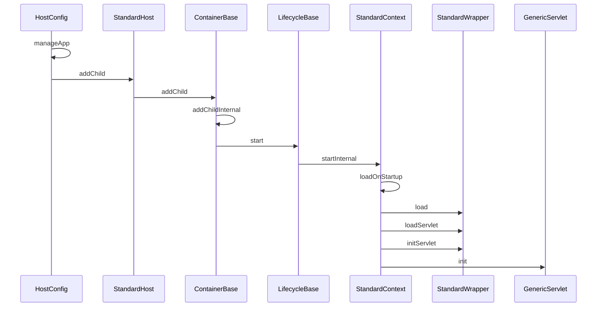
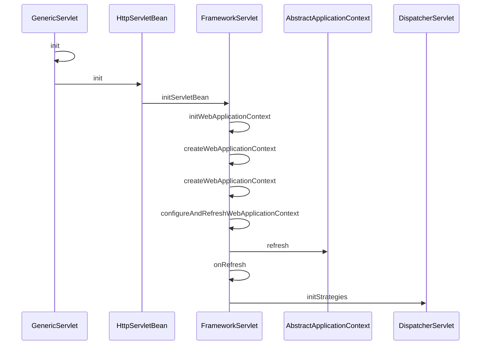

StandardContext
StandardContextValve

StandardEngine
StandardEngineValve

StandardHost
StandardHostValve

StandardPipeline
StandardServer
StandardService

StandardThreadExecutor

StandardWrapper
StandardWrapperFacade
StandardWrapperValve

### tomcat 加载 app servlet

### springmvc dispatcherServlet init
