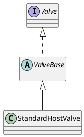

org.apache.catalina.core.StandardHostValve
## package
```
LifecycleBase (org.apache.catalina.util)
    LifecycleMBeanBase (org.apache.catalina.util)
        ValveBase (org.apache.catalina.valves)
            StandardHostValve (org.apache.catalina.core)
```

## define
