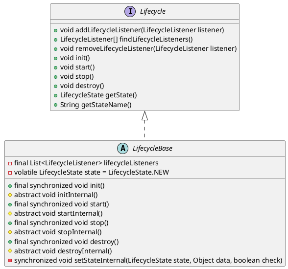

* org.apache.catalina.util.LifecycleBase
* org.apache.catalina.Lifecycle

## hierarchy
```
LifecycleBase (org.apache.catalina.util)
    AbstractResourceSet (org.apache.catalina.webresources)
        LoaderHidingWebResourceSet in TomcatServletWebServerFactory (org.springframework.boot.web.embedded.tomcat)
        AbstractArchiveResourceSet (org.apache.catalina.webresources)
        AbstractFileResourceSet (org.apache.catalina.webresources)
    EmptyResourceSet (org.apache.catalina.webresources)
    StandardPipeline (org.apache.catalina.core)
    LifecycleMBeanBase (org.apache.catalina.util)
        FailedContext (org.apache.catalina.startup)
        ContainerBase (org.apache.catalina.core)
            StandardEngine (org.apache.catalina.core)
            StandardWrapper (org.apache.catalina.core)
            StandardContext (org.apache.catalina.core)
                TomcatEmbeddedContext (org.springframework.boot.web.embedded.tomcat)
            StandardHost (org.apache.catalina.core)
        ManagerBase (org.apache.catalina.session)
        WebappLoader (org.apache.catalina.loader)
        StandardThreadExecutor (org.apache.catalina.core)
        Connector (org.apache.catalina.connector)
        StandardServer (org.apache.catalina.core)
        MapperListener (org.apache.catalina.mapper)
        StandardService (org.apache.catalina.core)
        RealmBase (org.apache.catalina.realm)
        StandardRoot (org.apache.catalina.webresources)
        NamingResourcesImpl (org.apache.catalina.deploy)
        ValveBase (org.apache.catalina.valves)
    StoreBase (org.apache.catalina.session)
        JDBCStore (org.apache.catalina.session)
        FileStore (org.apache.catalina.session)
    SessionIdGeneratorBase (org.apache.catalina.util)
        StandardSessionIdGenerator (org.apache.catalina.util)
            LazySessionIdGenerator (org.springframework.boot.web.embedded.tomcat)
```


## define

