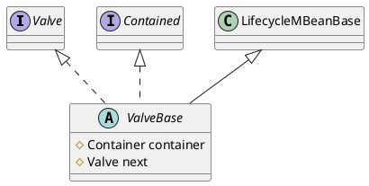

org.apache.catalina.valves.ValveBase

## hierarchy
```
LifecycleBase (org.apache.catalina.util)
    LifecycleMBeanBase (org.apache.catalina.util)
        ValveBase (org.apache.catalina.valves)
            RemoteIpValve (org.apache.catalina.valves)
            JDBCAccessLogValve (org.apache.catalina.valves)
            AbstractAccessLogValve (org.apache.catalina.valves)
            ErrorReportValve (org.apache.catalina.valves)
            StandardWrapperValve (org.apache.catalina.core)
            RewriteValve (org.apache.catalina.valves.rewrite)
            SemaphoreValve (org.apache.catalina.valves)
            AuthenticatorBase (org.apache.catalina.authenticator)
            StandardContextValve (org.apache.catalina.core)
            SingleSignOn (org.apache.catalina.authenticator)
            CrawlerSessionManagerValve (org.apache.catalina.valves)
            AccessLogValve (org.apache.catalina.valves)
            RequestFilterValve (org.apache.catalina.valves)
            StandardEngineValve (org.apache.catalina.core)
            StuckThreadDetectionValve (org.apache.catalina.valves)
            SSLValve (org.apache.catalina.valves)
            PersistentValve (org.apache.catalina.valves)
            CometConnectionManagerValve (org.apache.catalina.valves)
            StandardHostValve (org.apache.catalina.core)
```
* StandardEngineValve
* StandardHostValve
* StandardContextValve
* StandardWrapperValve

## define

