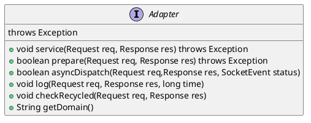

org.apache.coyote.Adapter

## hierarchy
```
Adapter (org.apache.coyote)
    CoyoteAdapter (org.apache.catalina.connector)
```

## define

```plantuml
@startuml

interface Adapter {

    + void service(Request req, Response res) throws Exception
    + boolean prepare(Request req, Response res) throws Exception
    + boolean asyncDispatch(Request req,Response res, SocketEvent status)
            throws Exception
    + void log(Request req, Response res, long time)
    + void checkRecycled(Request req, Response res)
    + String getDomain()
}

@enduml
```