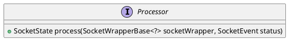

org.apache.coyote.Processor

## hierachy
```
Processor (org.apache.coyote)
    AbstractProcessorLight (org.apache.coyote)
    AbstractProcessor (org.apache.coyote)
        AjpProcessor (org.apache.coyote.ajp)
        Http11Processor (org.apache.coyote.http11)
        StreamProcessor (org.apache.coyote.http2)
    UpgradeProcessorBase (org.apache.coyote.http11.upgrade)
        UpgradeProcessorExternal (org.apache.coyote.http11.upgrade)
        UpgradeProcessorInternal (org.apache.coyote.http11.upgrade)
```

## define

