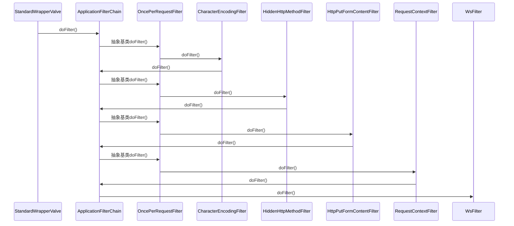

javax.servlet.FilterChain
##  define

```
FilterChain (javax.servlet)
    ApplicationFilterChain (org.apache.catalina.core)
    CachedChain in ServletHandler (org.mortbay.jetty.servlet)
    Chain in ServletHandler (org.mortbay.jetty.servlet)
    MockFilterChain (org.springframework.mock.web)
    PassThroughFilterChain (org.springframework.mock.web)
```

## 请求在过滤器中传递


