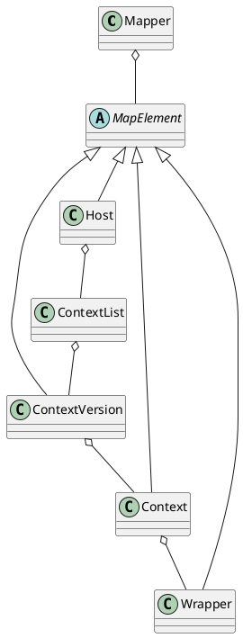

org.apache.tomcat.util.http.mapper.Mapper

## define

```plantuml
@startuml

class Mapper

abstract class MapElement
class Host
class ContextList
class Context
class ContextVersion
class Wrapper

MapElement ^-- Host
MapElement ^-- Context
MapElement ^-- ContextVersion
MapElement ^-- Wrapper

Host o-- ContextList
ContextList o-- ContextVersion
ContextVersion o-- Context
Context o-- Wrapper

Mapper o-- MapElement

@enduml
```