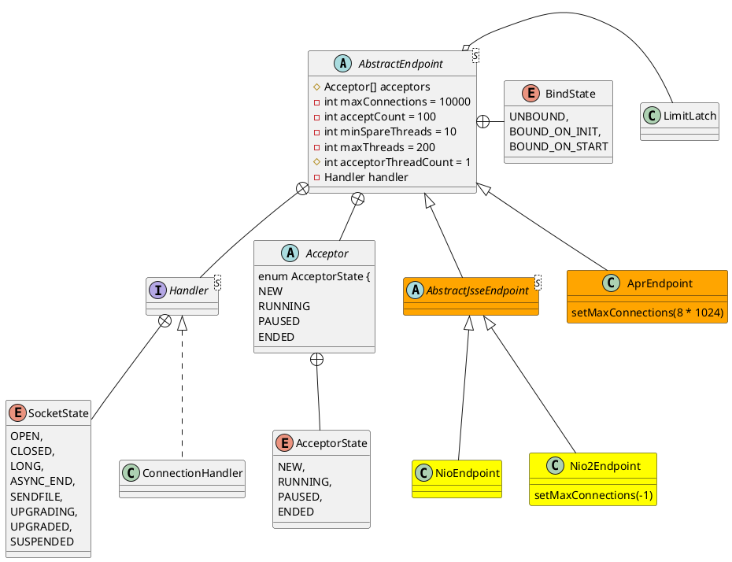

org.apache.tomcat.util.net.AbstractEndpoint
## tcp
TCP协议：端对端的、面向字节流、面向连接的、全双工可靠的传输层协议

## hierarchy
```
AbstractEndpoint (org.apache.tomcat.util.net)
    AbstractJsseEndpoint (org.apache.tomcat.util.net)
        NioEndpoint (org.apache.tomcat.util.net)
        Nio2Endpoint (org.apache.tomcat.util.net)
    AprEndpoint (org.apache.tomcat.util.net)
```

## define


## methods

### createExecutor()
```
public void createExecutor() {
    internalExecutor = true;
    TaskQueue taskqueue = new TaskQueue();
    TaskThreadFactory tf = new TaskThreadFactory(getName() + "-exec-", daemon, getThreadPriority());
    executor = new ThreadPoolExecutor(getMinSpareThreads(), getMaxThreads(), 60, TimeUnit.SECONDS,taskqueue, tf);
    taskqueue.setParent( (ThreadPoolExecutor) executor);
}
```