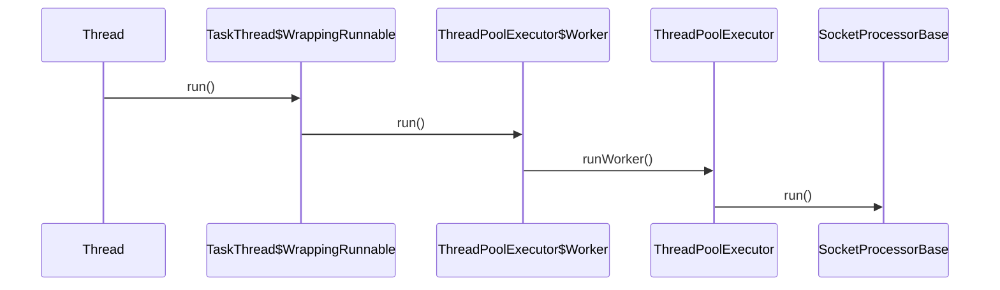

org.apache.tomcat.util.threads.TaskThread

## define

## hierachical

```yuml
// {type:class}
[Runnable]^-.-[Thread]
[Thread]++-[Runnable]
[Thread]++-[ThreadGroup]


[Thread]^-[TaskThread]

[TaskThread]+->[WrappingRunnable]
[Runnable]^-.-[WrappingRunnable]

```

## thread.run() -> SocketProcessorBase.run()



[SocketProcessorBase](../../SocketProcessorBase.md)