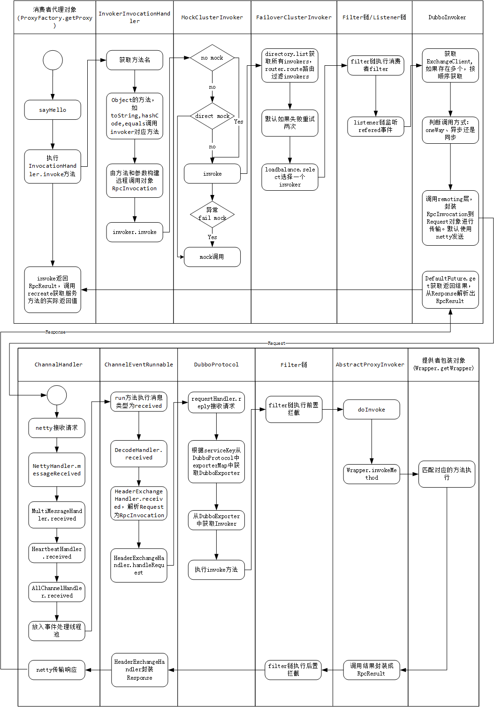

## 服务调用

* InvokerInvocationHandler


```
-- 提供方
<dubbo:application name="demo-provider"/>
<dubbo:registry address="zookeeper://127.0.0.1:2181"/>
<dubbo:protocol name="dubbo" port="20880"/>
<bean id="demoService" class="com.alibaba.dubbo.demo.provider.DemoServiceImpl"/>
<dubbo:service interface="com.alibaba.dubbo.demo.DemoService" ref="demoService"/>

-- 消费方
<dubbo:application name="demo-consumer"/>
<dubbo:registry address="zookeeper://127.0.0.1:2181"/>
<dubbo:reference id="demoService" check="false" interface="com.alibaba.dubbo.demo.DemoService"/>
```

consumer -> RpcInvocation -> Request -> transport -> decode -> RpcResult

整个服务的调用过程都是以Invoker接口为核心，通过不同的Invoker实现对象层层调用，完成整个RPC的调用。在调用过程中，消费方构建包含调用信息的RpcInvocation，并封装在Request中，传输到调用方，调用方解析出Request中的RpcInvocation完成调用，并将调用结果RpcResult封装到Response中返回，然后由消费方接收后再从Response中解析出RpcResult中携带的调用结果完成整个调用。

### 服务消费方发起请求

消费方获取的demoService实例对象实际是代理工厂ProxyFactory.getProxy创建的代理对象

> proxy -> InvokerInvocationHandler.invoke() -> MockClusterInvoker.invoke() -> FailoverClusterInvoker.invoke() -> FilterChain, Listener -> DubboInvoker

1. 代理对象执行sayHello方法
2. 将**方法名和方法参数**传入InvokerInvocationHandler.invoke执行
3. 执行MockClusterInvoker.invoke方法，MockClusterInvoker是Cluster服务接口的Wrapper包装类MockClusterWrapper调用join方法返回的Invoker对象。
4. 执行FailoverClusterInvoker.invoke，Failover是Cluster集群的默认策略。invoke方法由AbstractClusterInvoker执行，然后调用FailoverClusterInvoker的doInvoke实现。
5. 执行Filter过滤器链和Listener监听器链的invoke方法
6. 最终由DubboInvoker执行对远程服务的调用


### 服务提供方接收调用请求

> NettyHandler(ChannelHandler...) -> DubboProtocol -> FilterInvokerChain -> JavassistProxyFactory.getInvoker() -> Wrapper

1. 从netty接收请求交予NettyHandler处理，到DubboProtocol的requestHandler，中间经过很多ChannelHandler，对请求的消息进行不同的处理。
2. DubboProtocol的requestHandler是一个ExchangeHandlerAdapter的内部类，received方法又调用reply方法，判断message是Invocation类型，根据Invocation获取服务调用Invoker。
3. 经过提供方Filter Invoker链，执行前置拦截，由Protocol的包装类ProtocolFilterWrapper.export再调用buildInvokerChain构建。
4. 调用JavassistProxyFactory.getInvoker生成的AbstractProxyInvoker.invoke
5. 通过Wrapper包装类，执行真正的demoService的方法


### 服务调用结果返回

当提供方执行完真正服务实现的方法后，需要将返回值传输给消费方

1. 提供方在AbstractProxyInvoker中组装返回结果成RpcResult
2. 提供方部分Filter链还有后置拦截操作，如处理异常的ExceptionFilter
3. 在HeaderExchangeHandler.handleRequest方法中，将RpcResult封装到Response返回
4. 经过网络传输，回到消费方，DefaultFuture.returnFromResponse方法从Response中解析出RpcResult
5. 经过层层返回，来到InvokerInvocationHandler，调用RpcResult.recreate方法返回调用结果

### Request和Response的组装和解析

Request - Response
RpcInvocation - RpcResult

``` java
RpcInvocation [
	methodName=helloworld, 
	parameterTypes=[class java.lang.Integer], 
	arguments=[1234], 
	attachments={
		dubbo=2.5.3, 
		input=322, 
		path=com.onion.test.Hello, 
		interface=com.onion.test.Hello, 
		timeout=1800000, 
		version=0.0.0}
]

// handleRequest方法
Response HeaderExchangeHandler.handleRequest(ExchangeChannel channel, Request req);
```

1. 消费方执行HeaderExchangeChannel.request时将RpcInvocation组装成Request
2. 提供方执行HeaderExchangeHandler.handleRequest时，解析出Request的RpcInvocation，并将返回结果RpcResult封装到Response中
3. 消费方等待提供方返回然后在DefaultFuture.get方法中执行returnFromResponse方法，从Response中获取RpcResult

 

[Dubbo解析(六)-服务调用](https://my.oschina.net/u/2377110/blog/1857642 "title") 

[https://blog.csdn.net/quhongwei_zhanqiu/article/details/41701979](https://blog.csdn.net/quhongwei_zhanqiu/article/details/41701979 "title") 

