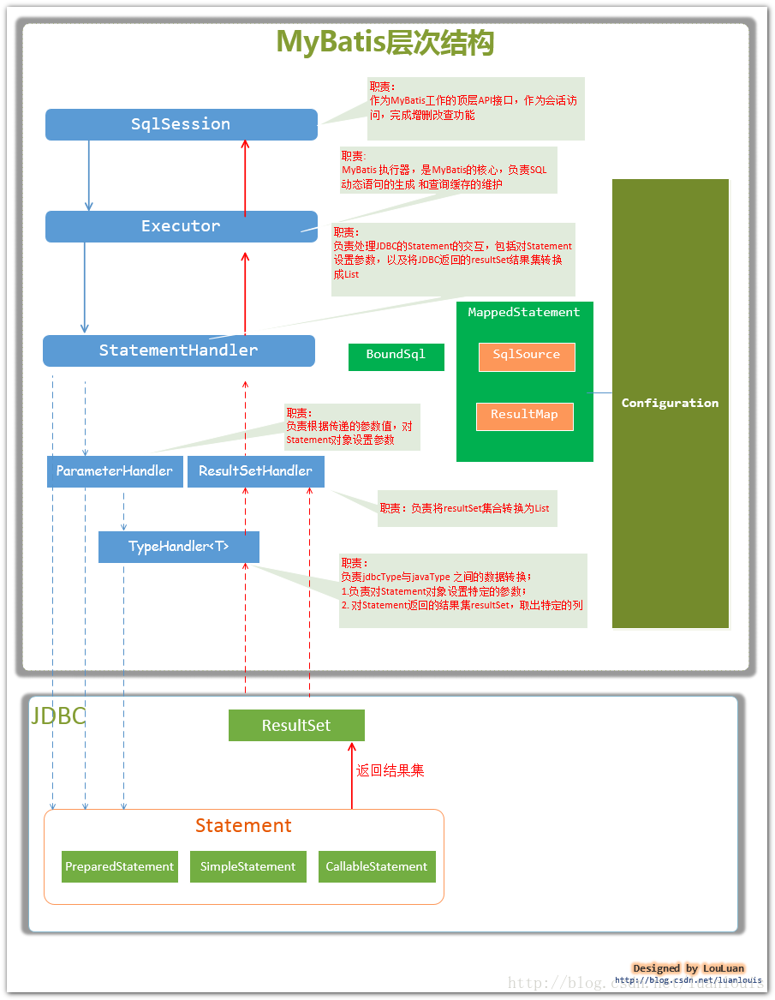
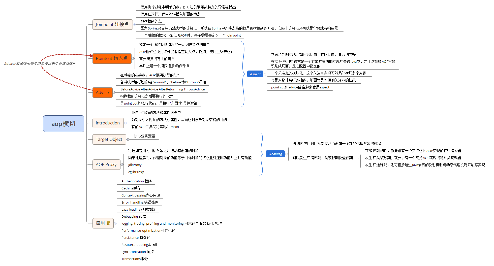
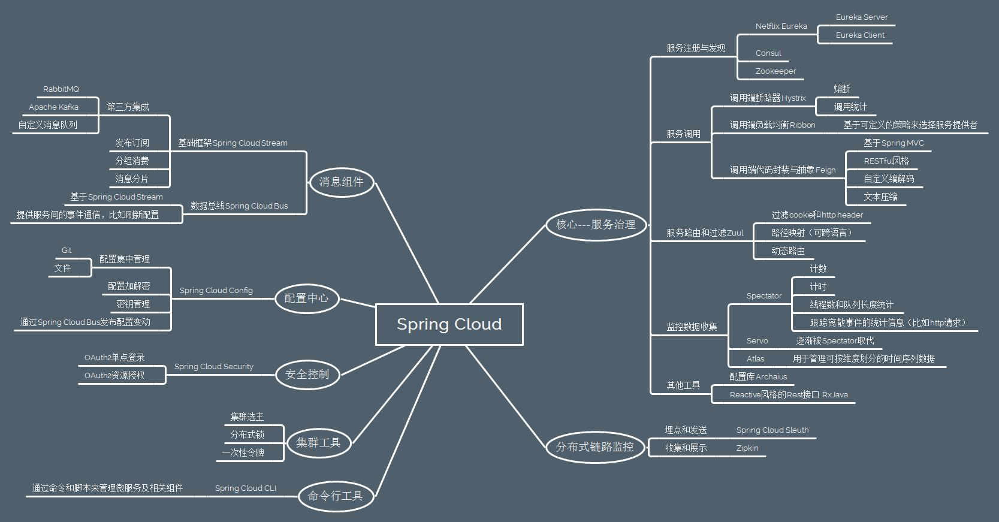
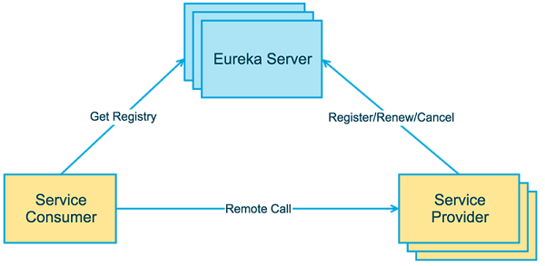
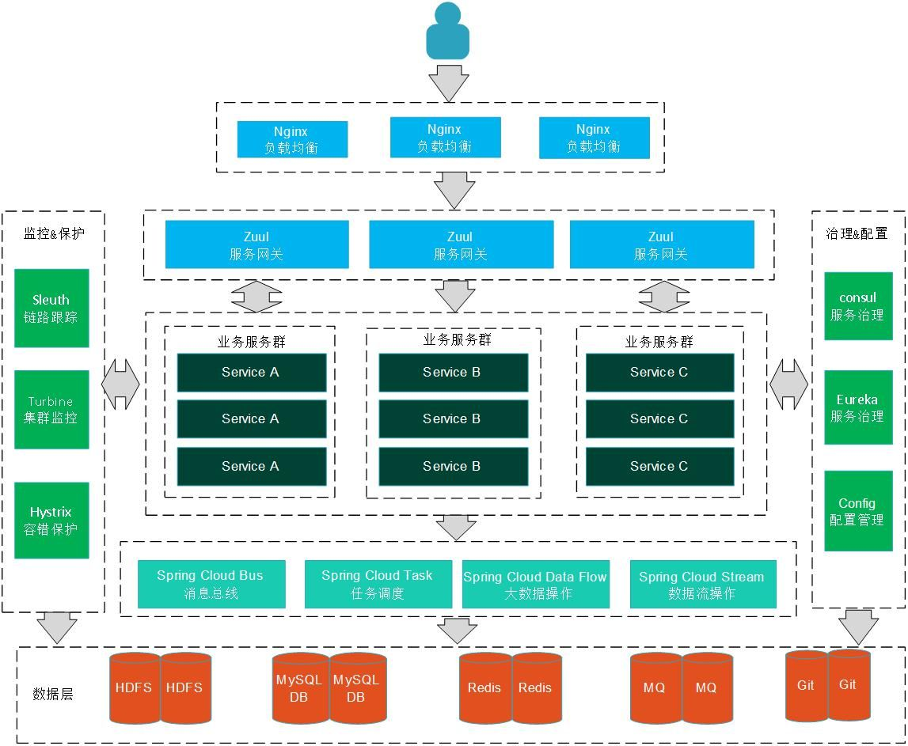
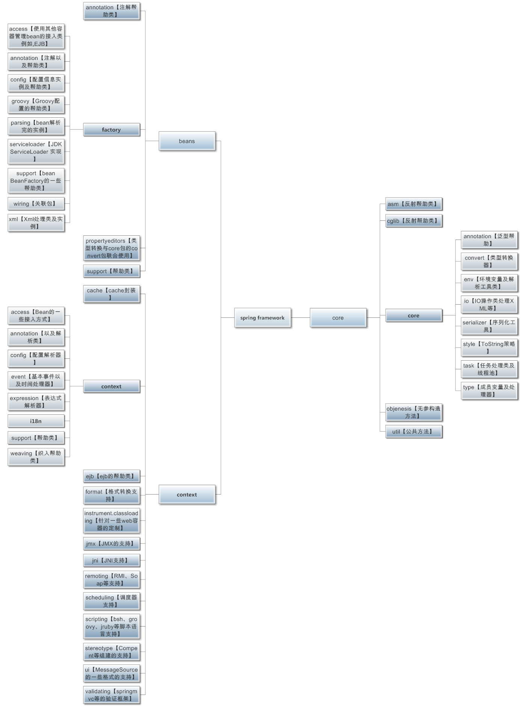
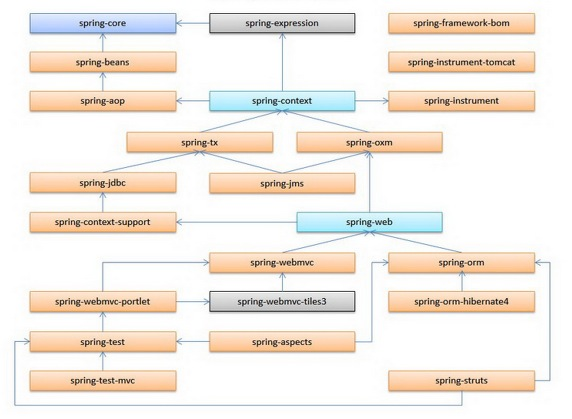
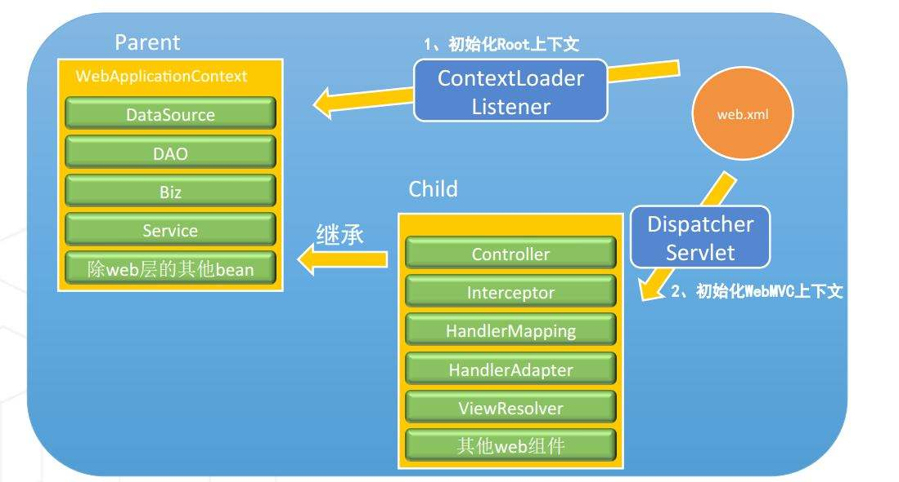
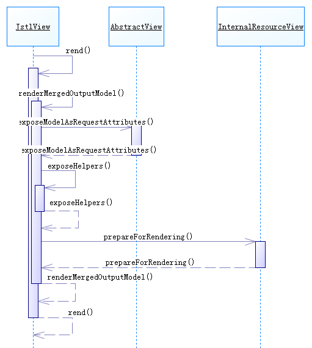
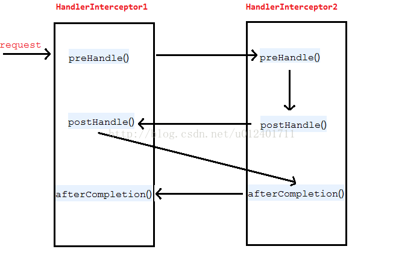

# image to markdown

## common-jars.png

 

## dubbo-architecture-00.png

 

## dubbo-architecture.png

 

## dubbo-framework.jpg

 

## dubbo-modules.jpg

 

## mybatis-cache.png

 

## mybatis-hierarchy.png

 

## mybatis.png

 

## netty-components.png

 

## netty.png

 

## redis-app1.jpg

 

## redis-app2.jpg

 

## spring-aop-concept.png

 

## spring-beanfactory-init.png

 

## spring-beanfactory.png

 

## spring-beans-hierarchy.jpg

 

## spring-beans-life-00.png

 

## spring-beans-life-01.png

 

## spring-beans-life-02.jpg

 

## spring-beans-life.png

 

## spring-beans-parser.png

 

## spring-beans-scope.png

 

## spring-cache-el.jpg

 

## spring-cloud-knowledge.jpg

 

## spring-cloud-provider-consumer-eureka.png

 

## spring-cloud-structure.jpg

 

## spring-core-context-beans.png

 

## spring-core-jar.png

 

## spring-core.png

 

## spring-data-repository.jpg

 

## spring-data.jpg

 

## spring-factory-bean-start.jpg

 

## spring-jars-dependency.jpg

 

## spring-jars.jpg

 

## spring-mvc-context-start.jpg

 

## spring-mvc-start.jpg

 

## spring.png

 

## springaop-cache.png

 

## springmvc-data-transform.PNG

 

## springmvc-dispatcherservlet-dodispatch.png

 

## springmvc-dispatcherservlet-init.png

 

## springmvc-dispatcherservlet-view-render.png

 

## springmvc-dispatcherservlet.png

 

## springmvc-http-message-converter.png

 

## springmvc.JPG

 

## 多个拦截器执行顺序.png

 

