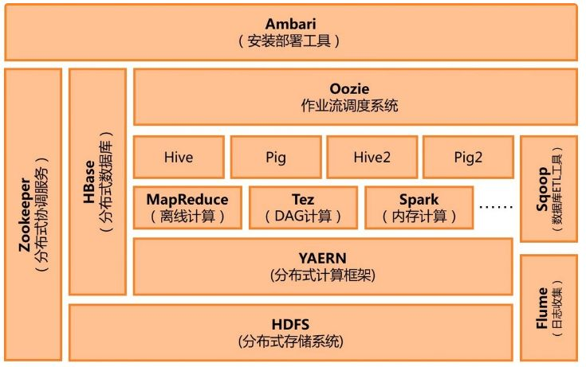

### hadoop应用场景
大数据量存储：分布式存储（各种云盘，百度，360~还有云平台均有hadoop应用） 
日志处理: Hadoop擅长这个 
海量计算: 并行计算 
ETL:数据抽取到oracle、mysql、DB2、mongdb及主流数据库 
使用HBase做数据分析: 用扩展性应对大量读写操作—Facebook构建了基于HBase的实时数据分析系统 
机器学习: 比如Apache Mahout项目（Apache Mahout简介 常见领域：协作筛选、集群、归类） 
搜索引擎:hadoop + lucene实现 
数据挖掘：目前比较流行的广告推荐 大量地从文件中顺序读。HDFS对顺序读进行了优化，代价是对于随机的访问负载较高。 用户行为特征建模 个性化广告推荐 智能仪器推荐

### HDFS

*	Zookeeper  解决一致性问题 
*	HDFS  分布式存储机制
*	HBase  分布式数据库
*	MapReduce  Map和Reduce处理
*	Hadoop Common  通用功能模块，提供工具，如配置文件和日志操作等

 

[Hadoop系统架构](http://www.cnblogs.com/yangsy0915/p/4866995.html "title") 

### MapReduce
