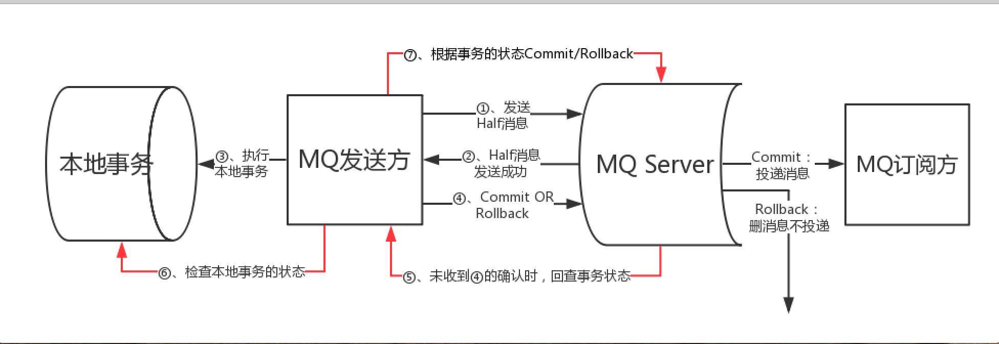

分布式事务是一个复杂的问题，rmq实现了事务的最终一致性，rmq保证本地事务成功消息一定会发送成功并被成功消费，如果本地事务失败了，消息不会被发送。

rmq事务消息的实现过程为：

1. producer发送half消息
2. broker确认half消息，并通知producer，表示消息已经成功发送到broker（这个过程其实就是步骤1broker的返回）
3. producer收到half确认消息之后，执行自己本地事务，并将事务结果（UNKNOW、commit、rollback）告诉broker（这是一个oneway消息，而且失败不重试）
4. broker收到producer本地事务的结果后决定是否投递消息给consumer
5. 鉴于producer发送本地事务结果可能失败，broker会定时扫描集群中的事务消息，然后回查(apache4.2.0尚未实现，因为没有调用org.apache.rocketmq.broker.client.net.Broker2Client#checkProducerTransactionState)

 

> broker定时扫描集群中的事务消息，然后回查producer业务状态

### producer发送half消息

### producer结束事务

### broker决定消息是否可以投递

### consumer保证消费成功

