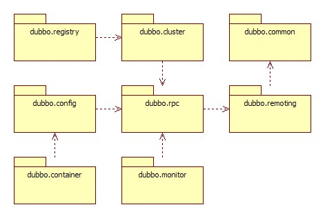
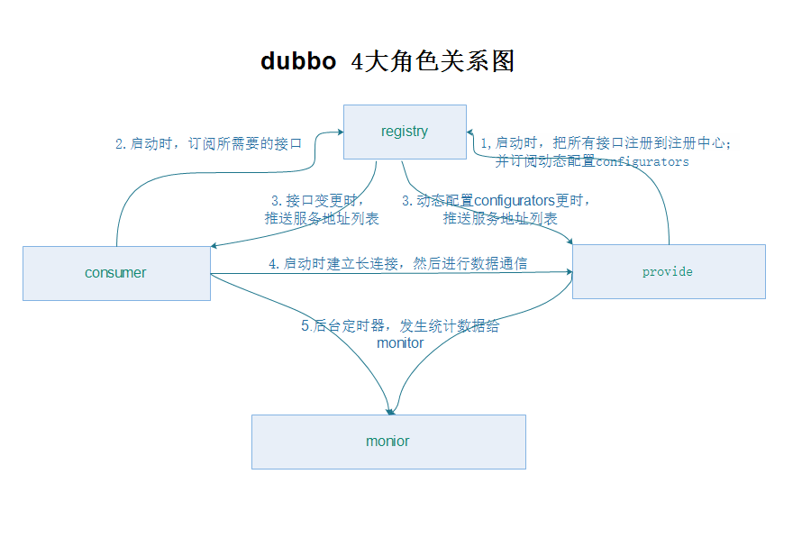

## 简易流程

	Cilent		==> 	Provider
	接口 + 入参 > 序列化 > 发送字节流	---> 接收字节流 > 序列化 > 接口 + 入参

	Provider	==> 	Cilent
	结果 > 序列化 > 发送字节流		---> 接收字节流 > 序列化 > 接口 + 出参

1.	序列化组件，因为需要远程调用，所以需要将参数以二进制流的形式进行编码操作
2.	发送组件，将二进制流发送到服务端
3.	接收组件，接收调用端发送的二进制流以及接收服务端返回的二进制流

将调用端以消费者的身份进行信息注册
监听注册中心的信息变化以刷新本地对服务注册信息的缓存

### 整体设计

 

### 各层说明

#### 1.business
*	service

#### 2.rpc
*	config      配置层：对外配置接口，以 ServiceConfig, ReferenceConfig 为中心，可以直接初始化配置类，也可以通过 spring 解析配置生成配置类
*	proxy       服务代理层：服务接口透明代理，生成服务的客户端 Stub 和服务器端 Skeleton, 以 ServiceProxy 为中心，扩展接口为 ProxyFactory
*	registry    注册中心层：封装服务地址的注册与发现，以服务 URL 为中心，扩展接口为 RegistryFactory, Registry, RegistryService
*	cluster     路由层：封装多个提供者的路由及负载均衡，并桥接注册中心，以 Invoker 为中心，扩展接口为 Cluster, Directory, Router, LoadBalance
*	monitor     监控层：RPC 调用次数和调用时间监控，以 Statistics 为中心，扩展接口为 MonitorFactory, Monitor, MonitorService
*	protocol    远程调用层：封装 RPC 调用，以 Invocation, Result 为中心，扩展接口为 Protocol, Invoker, Exporter

#### 3.remoting
*	exchange    信息交换层：封装**请求响应模式**，同步转异步，以 Request, Response 为中心，扩展接口为 Exchanger, ExchangeChannel, ExchangeClient, ExchangeServer
*	transport   网络传输层：抽象 mina 和 netty 为统一接口，以 Message 为中心，扩展接口为 Channel, Transporter, Client, Server, Codec
*	serialize   数据序列化层：可复用的一些工具，扩展接口为 Serialization, ObjectInput, ObjectOutput, ThreadPool

### 模块分包

 

*	dubbo-common    公共逻辑模块：包括 Util 类和通用模型。
*	dubbo-remoting  远程通讯模块：相当于 Dubbo 协议的实现，如果 RPC 用 RMI协议则不需要使用此包。
*	dubbo-rpc       远程调用模块：抽象各种协议，以及动态代理，只包含一对一的调用，不关心集群的管理。
*	dubbo-cluster   集群模块：将多个服务提供方伪装为一个提供方，包括：负载均衡, 容错，路由等，集群的地址列表可以是静态配置的，也可以是由注册中心下发。
*	dubbo-registry  注册中心模块：基于注册中心下发地址的集群方式，以及对各种注册中心的抽象。
*	dubbo-monitor   监控模块：统计服务调用次数，调用时间的，调用链跟踪的服务。
*	dubbo-config    配置模块：是 Dubbo 对外的 API，用户通过 Config 使用D ubbo，隐藏 Dubbo 所有细节。
*	dubbo-container 容器模块：是一个 Standlone 的容器，以简单的 Main 加载 Spring 启动，因为服务通常不需要 Tomcat/JBoss 等 Web 容器的特性，没必要用 Web 容器去加载服务。

### 协议支持

* Dubbo协议
* Hessian协议
* HTTP协议
* RMI协议
* WebService协议
* Thrift协议
* Memcached协议
* Redis协议

### 角色

注册中心、提供者、消费者、监控者

#### 1.ConfigServer
配置中心，和每个Server/Client之间会作一个实时的心跳检测（因为它们都是建立的Socket长连接），比如几秒钟检测一次。收集每个Server提供的服务的信息，每个Client的信息，整理出一个服务列表

当某个Server不可用，那么就更新受影响的服务对应的serverAddressList，即把这个Server从serverAddressList中踢出去（从地址列表中删除）
同时将推送serverAddressList给这些受影响的服务的clientAddressList里面的所有Client。
当某个Client挂了，那么更新受影响的服务对应的clientAddressList
ConfigServer根据服务列表，就能提供一个web管理界面，来查看管理服务的提供者和使用者。

新加一个Server时，由于它会主动与ConfigServer取得联系，而ConfigServer又会将这个信息主动发送给Client，所以新加一个Server时，只需要启动Server，然后几秒钟内，Client就会使用上它提供的服务

#### 2. Client
调用服务的机器，每个Client启动时，主动与ConfigServer建立Socket长连接，并将自己的IP等相应信息发送给ConfigServer。
Client在使用服务的时候根据服务名称去ConfigServer中获取服务提供者信息（这样ConfigServer就知道某个服务是当前哪几个Client在使用），Client拿到这些服务提供者信息后，与它们都建立连接，后面就可以直接调用服务了，当有多个服务提供者的时候，Client根据一定的规则来进行负载均衡，如轮询，随机，按权重等。
一旦Client使用的服务它对应的服务提供者有变化（服务提供者有新增，删除的情况），ConfigServer就会把最新的服务提供者列表推送给Client，Client就会依据最新的服务提供者列表重新建立连接，新增的提供者建立连接，删除的提供者丢弃连接

#### 3. Server
真正提供服务的机器，每个Server启动时，主动与ConfigServer建立Scoket长连接，并将自己的IP，提供的服务名称，端口等信息直接发送给ConfigServer，ConfigServer就会收集到每个Server提供的服务的信息。

### dubbo-architecture

 

 
