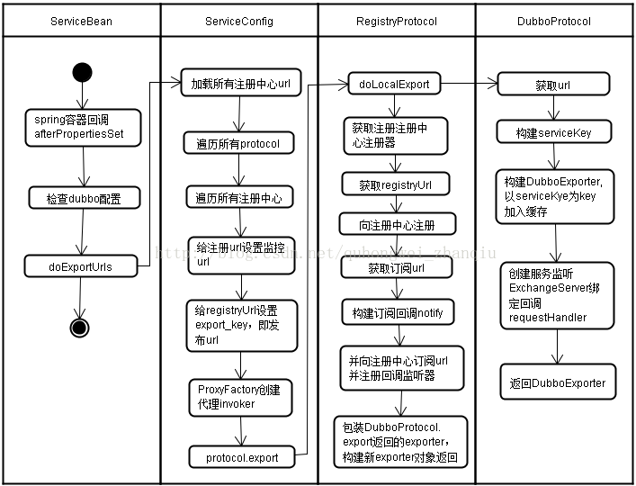

## 服务发布

[Dubbo解析(四)-服务发布](https://my.oschina.net/u/2377110/blog/1840477) 

### Dubbo的消费者和提供者的交互过程

1. 提供者向注册中心注册，并暴露本地服务
2. 消费者向注册中心注册，并订阅提供者列表
3. 消费者获取提供者列表，
4. 消费者按照负载均衡选择一个提供者，直接调用其服务

* dubbo:service
* ServiceBean
* ServiceConfig
* RegistryProtocol
* DubboProtocol

Dubbo的提供者(dubbo:service)转换成ServiceBean将服务发布出去，ServiceBean继承ServiceConfig抽象配置类，同时实现多个Spring相关的容器接口。

当Spring启动后触发ContextRefreshedEvent事件，会调用onApplicationEvent方法

``` java
public void onApplicationEvent(ContextRefreshedEvent event) {
    if (isDelay() && !isExported() && !isUnexported()) {
        export();
    }
}
```
从而执行export方法。export方法定义在ServiceConfig类中，经过一系列的校验和配置组装，最终调用doExportUrls，发布所有的url。

#### ServiceConfig.doExportUrls执行服务export

dubbo:service : ServiceConfig
dubbo:application : ApplicationConfig，应用配置类
dubbo:registry : RegistryConfig，注册中心配置类
dubbo:protocol : ProtocolConfig，服务协议配置类

doExportUrls方法分成两部分
1. 获取所有注册中心的URL
2. 遍历所有协议ProtocolConfig，将每个protocol发布到所有注册中心上

#### loadRegistries获取注册中心URL

首先执行checkRegistry，判断是否有配置注册中心，如果没有，则从默认配置文件dubbo.properties中读取dubbo.registry.address组装成RegistryConfig。
然后根据RegistryConfig的配置，组装registryURL，形成的URL格式如下

#### doExportUrlsFor1Protocol发布服务和注册

因为dubbo支持多协议配置，对于每个ProtocolConfig配置，组装protocolURL，注册到每个注册中心上。

构建出的protocolURL格式如下

```
dubbo://192.168.199.180:20880/com.alibaba.dubbo.demo.DemoService?
anyhost=true&
application=demo-provider&
bind.ip=192.168.199.180&
bind.port=20880&
dubbo=2.0.0&
generic=false&
interface=com.alibaba.dubbo.demo.DemoService&
methods=sayHello&
pid=5744&
qos.port=22222&
side=provider&
timestamp=1530746052546
```

#### RegistryProtocol.export暴露服务

1. 从Invoker中获取providerURL，同传入的Invoker对象组装成InvokerDelegete，通过protocol.export根据providerURL(一般为dubbo协议)暴露服务，打开服务器端口，获得Exporter缓存到本地。
2. 修改registryUrl，将其协议由registry改为具体的注册中心协议，即registry://改为zookeeper://。
3. 根据registryUrl从RegistryFactory根据SPI机制获取具体的Registry
4. 获取要注册的providerUrl，移除不需要在注册中心看到的providerUrl中部分参数
5. 将providerUrl注册到注册中心，如果注册中心为zookeeper，则使用ZookeeperRegistry注册器进行注册
6. 从registryUrl组装overrideSubscribeUrl，并构建OverrideListener，向注册中心订阅overrideSubscribeUrl，用于当配置数据变化时，触发overrideListener的notify方法通知提供者重新暴露服务。
7. 将本地暴露的exporter，传入的参数originInvoker以及overrideSubscribeUrl和registedProviderUrl封装成新的DestroyableExporter返回，供消费者调用时获取。

#### DubboProtocol暴露本地服务

1. 从Invoker获取providerUrl，构建serviceKey(group/service:version:port)，构建DubboExporter并以serviceKey为key放入本地map缓存
2. 处理url携带的本地存根和callback回调
3. 根据url打开服务器端口，暴露本地服务。先以url.getAddress为key查询本地缓存serverMap获取ExchangeServer，如果不存在，则通过createServer创建。
4. createServer方法，设置心跳时间，判断url中的传输方式(key=server,对应Transporter服务)是否支持，设置codec=dubbo，最后根据url和ExchangeHandler对象绑定server返回，这里的ExchangeHandler非常重要，它就是消费方调用时，底层通信层回调的Handler，从而获取包含实际Service实现的Invoker执行器，它是定义在DubboProtocol类中的ExchangeHandlerAdapter内部类。
5. 返回DubboExporter对象

服务发布序列图及活动图

> Actor -> ServiceBean -> ServiceConfig -> ProxyFactory -> Invoker -> Protocol -> Exporter -> Transporter -> Server -> ExporterListener -> Registry

 

 