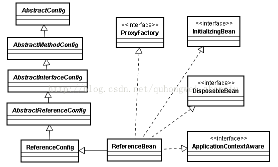

## 服务引用

dubbo:reference  ReferenceBean

 

ReferenceBean实现了spring.FactoryBean

spring的bean工厂beanFactory.getBean("demoService")获取的bean的时候会判断下是不是FactoryBean的实例，如果是调factoryBean.getObject()返回，否则返回bean。

对于远程调用获取的demoService其实并不是想要ReferenceBean这个对象实例本身，我们是想获取对远程调用的代理，能够通过这个代理服务调用远程服务。这里就是通过factoryBean.getObject()来创建引用返回基于DemoService接口的代理给引用，对用户透明dubbo封装了复杂实现


### 创建代理的过程：

dubbo:reference -> dubbo:registry -> List<URL> -> referUrl -> cluster invoker(loadbalance) -> actual invoker -> proxyFactory.getProxy(invoker)

1. 获取消费者配置
2. 获取配置的注册中心，通过配置中心配置拼装URL，线上应该是个配置中心集群
3. 遍历注册中心List<URL>集合
加载监控中心URL，如果配置了监控中心在注册中心url加上MONITOR_KEY
根据配置的引用服务参数给注册中URL上加上REFER_KEY

4. 遍历注册中心List<URL>集合，这里注册中心url包含了monitorUrl和referUrl
protocol.refer(interface,url)调用protocol引用服务返回invoker可执行对象（这个invoker并不是简单的DubboInvoker, 而是由RegistryProtocol构建基于目录服务的集群策略Invoker, 这个invoker可以通过目录服务list出真正可调用的远程服务invoker）
对于注册中心Url设置集群策略为AvailableCluster， 由AvailableCluster将所有对象注册中调用的invoker伪装成一个invoker

5. 通过代理工厂创建远程服务代理返回给使用着proxyFactory.getProxy(invoker);


### procotol.refer(interface, url) 引用服务的过程

ProtocolListenerWrapper -> registry -> group -> RegistryDirectory -> subscribeUrl(build, registry, subscribe) -> cluster.join(directory)

1. 经过ProtocolListenerWrapper， ProtocolFilterWrapper由于是注册中心url调用RegistryProtocol.refer
2. 获取注册中心协议zookeeper, redis, 还是dubbo， 并根据注册中心协议通过注册器工厂RegistryFactory.getRegistry(url)获取注册器Registry用来跟注册中心交互
3. 根据配置的group分组
4. 创建注册服务目录RegistryDirectory并设置注册器
5. 构建订阅服务的subscribeUrl
6. 通过注册器registry向注册中心注册subscribeUrl消费端url
7. 目录服务registryDirectory.subscribe(subscribeUrl)订阅服务
8. 通过cluster.join(directory) 合并invoker并提供集群调用策略


这里我们以开源版本zookeeper为注册中心为例来讲解， dubbo协议的注册中心有点不一样

其实内部也是通过注册器registry.subscribe(url,this) 这里this就是registryDirectory它实现了NotifyListener。

服务提供者向zookeeper注册服务/dubbo/com.alibaba.dubbo.demo.DemoService/providers/节点下写下自己的URL地址
服务消费者向zookeeper注册服务/dubbo/com.alibaba.dubbo.demo.DemoService/consumers/节点下写下自己的URL地址
服务消费者向zookeeper订阅服务/dubbo/com.alibaba.dubbo.demo.DemoService/providers/节点下所有服务提供者URL地址

Zookeeper通过watcher机制实现对节点的监听，节点数据变化通过节点上的watcher回调客户端， 重新生成对服务的refer

在订阅的过程中通过获取/dubbo/com.alibaba.dubbo.demo.DemoService/providers/下的所有服务提供者的urls

```
dubbo://10.33.37.8:20880/com.alibaba.dubbo.demo.DemoService?
anyhost=true&
application=demo-consumer&
check=false&
dubbo=2.0.0&
generic=false&
interface=com.alibaba.dubbo.demo.DemoService&
methods=sayHello&
owner=william&
pid=7356&
side=consumer&
timestamp=1416971340626
```
主动回调NotifyListener来根据urls生成对服务提供者的引用生成可执行invokers,供目录服务持有着，

### DubboProtocol.refer过程

ProtocolListenerWrapper -> DubboProtocol -> ExchangeClient -> DubboInvoker

1. 经过ProtocolListenerWrapper， ProtocolFilterWrapper构建监听器链和过滤器链。
2. DubboProtocol根据url获取ExchangeClient对象，如果是share存在就返回不存在创建新对象不是share直接创建。ExchangeClient是底层通信的客户端，对于通信层的创建功能不在这里讲解。
3. 创建DubboInvoker, 这个invoker对象包含对远程服务提供者的**长链接**，是真正执行远程服务调用的可执行对象
4. 将创建的invoker返回给目录服务

> Actor -> RefereneceBean -> ReferenceConfig -> RegistryProtocol -> Registry -> Directory -> Clustor -> Protocol -> Invoker -> Transporter -> Client -> InvokerListener -> ProxyFactory

 

[Dubbo原理解析-服务引用](https://blog.csdn.net/quhongwei_zhanqiu/article/details/41651487) 

