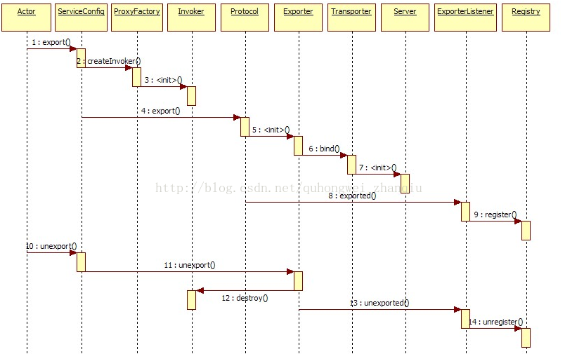
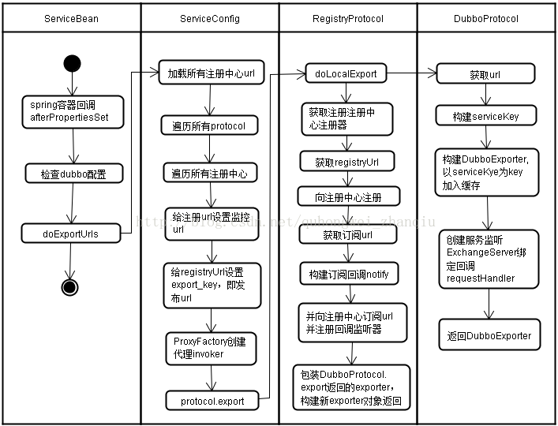

## export 过程
1. ServiceBean
    * afterPropertiesSet() 配置初始化
        - ProviderConfig
        - ApplicationConfig
        - RegistryConfig
        - MonitorConfig
        - ProtocolConfig
    * onApplicationEvent()
2. ServiceConfig.export() doExport() 配置检查
    * checkDefault() 
    * checkApplication() 
    * checkRegistry() 
    * checkProtocol() 
    * checkStubAndMock()
3. ServiceConfig.doExportUrls() 加载注册协议、遍历协议组装URL导出
    * loadRegistries()
    * doExportUrlsFor1Protocol() 为每种协议导出服务地址
        - registryURL Socket.connect()
        - 暴露本地服务 exportLocal
        - 暴露远程服务 多个注册中心、一个注册中心
            + loadMonitor(registryURL)
            + proxyFactory.getInvoker() 动态代理
            + protocol.export(invoker)  远程协议
                * RegistryProtocol.export(invoker) 服务注册、订阅、发现
                * DubboProtocol.export(invoker) 创建服务、交换层、传输层（绑定地址、监听端口）

## graph
```mermaid
graph LR
    subgraph config
        %% 1. 服务配置
       config["配置检查"] --> url["装配URL"]
    end

    subgraph export
        url  --> invoker{"创建invoker"}
        %% 2. injvm, remote
        invoker --> injvm["本地导出"]
        invoker --> remote{"远程导出"}
    end

    subgraph registry
        injvm --> registry{"服务注册"}
        remote --> registry
        registry --> registryCreate["节点创建"]
        registry --> noteCreate["服务订阅"]
    end

    subgraph subscribe
        invoker --> services["代理类"]
    end
```

## export 时序


## export 活动
