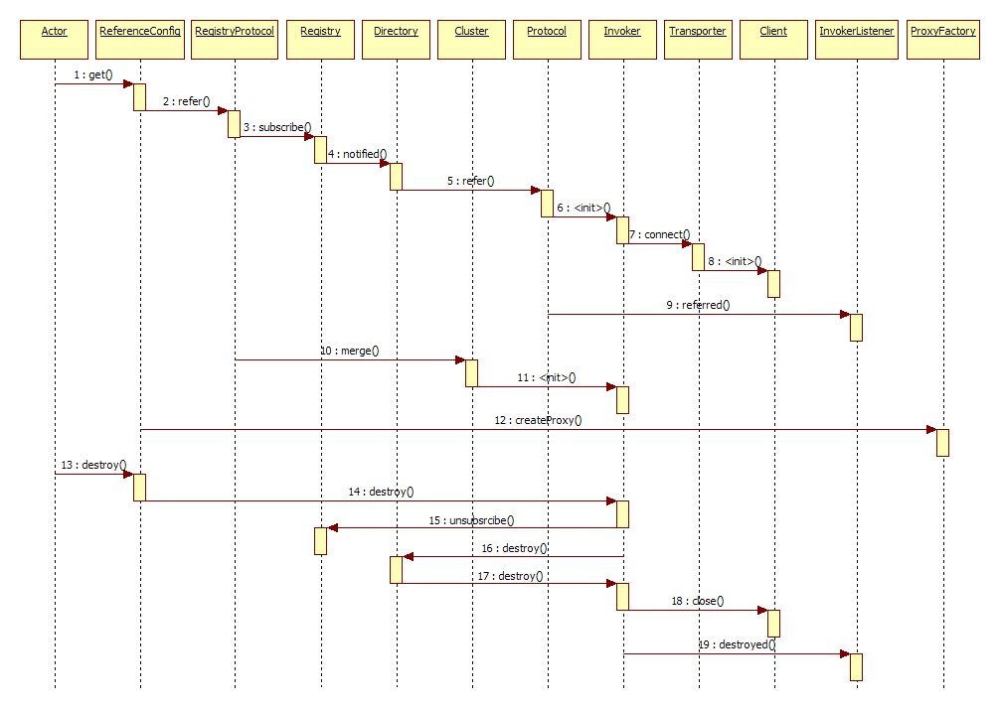

## refer 过程
1. ReferenceBean.getObject() synchronized
2. ReferenceConfig.init() 初始化配置
    * ApplicationConfig 
    * ModuleConfig 
    * RegistryConfig
    * MonitorConfig
3. ReferenceConfig.createProxy() 创建代理
    * Protocol.refer() 根据协议引用远程服务
        - InjvmProtocol 引入本地服务
        - DubboProtocol 
            + AbstractInterfaceConfig.loadRegistries() 加载注册中心
            + loadMonitor() 加载监控中心
            + RegistryProtocol.refer() 注册协议、注册目录、集群策略、过滤器包装、交换层、传输层连接
                + 只有一个服务提供者
                + Cluster.join() 多个服务提供者，集群
    * ProxyFactory.getProxy(invoker)  代理工厂生成代理
        - JavassistProxyFactory

## graph
```mermaid
graph LR
    subgraph config
        %% 1. 服务配置
       config["处理配置"]
    end

    subgraph refer
        config  --> decide{"服务引用方式"}
        %% 2. injvm, p2p, registries
        decide --> injvm["本地引用"]
        decide --> remote{"远程引用"}

        remote --> p2p["直连方式"]
        remote --> registries["注册中心方式"]

        p2p --> cluster["集群合并"]
        registries --> cluster["集群合并"]
    end

    subgraph invoker
        %% 3. invoker
        injvm --> invoker["可执行体"]
        cluster --> invoker
    end

    subgraph proxy
        %% 4. 生成代理
        invoker --> proxyFactory["代理类"]
    end
```

## refer 时序
