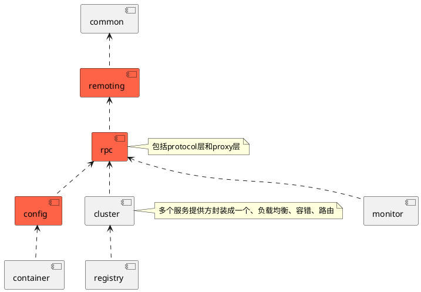

## dubbo
SpiEextension导引目路集衡调

* [common](/30-distributed/src/dubbo/common/README.md)
* [config](/30-distributed/src/dubbo/config/README.md)  配置模块：是Dubbo对外的 API，用户通过Config使用Dubbo，隐藏Dubbo所有细节
* [container](/30-distributed/src/dubbo/container/README.md)
* [monitor](/30-distributed/src/dubbo/monitor/README.md) 监控模块：统计服务调用次数，调用时间的，调用链跟踪的服务
* [registry](/30-distributed/src/dubbo/registry/README.md) 注册中心模块：基于注册中心下发地址的集群方式，以及对各种注册中心的抽象
* [remoting](/30-distributed/src/dubbo/remoting/README.md) 远程通讯模块：相当于 Dubbo 协议的实现，如果 RPC 用 RMI协议则不需要使用此包。
  * transport
    * dispatcher
      * [ChannelEventRunnable](/30-distributed/src/dubbo/remoting/transport/dispatcher/ChannelEventRunnable.md:1)
    * netty
      * [NettyChannel](/30-distributed/src/dubbo/remoting/transport/netty/NettyChannel.md)  
    * DecodeHandler
    * exchange
      * support
        * header
          * HeaderExchangeHandler 请求-响应模型
* [rpc](/30-distributed/src/dubbo/rpc/README.md) 远程调用模块：抽象各种协议，以及动态代理，只包含一对一的调用，不关心集群的管理
  * cluster 多个服务提供方封装成一个、负载均衡、容错、路由
  * protocol
    * dubbo
      * DubboProtocol
      * ProtocolFilterWrapper
      * InvokerWrapper
      * AbstractProxyInvoker
  * filter
    * EchoFilter
    * ClassLoaderFilter
    * GenericFilter
    * ContextFilter
    * TraceFilter
    * MonitorFilter
    * TimeoutFilter
    * ExceptionFilter
  * proxy
    * javassit
      * JavasistProxyFactory

### 解析
* [00-stack](/30-distributed/src/dubbo/00-stack.md)
* [10-export](/30-distributed/src/dubbo/10-export.md)
* [20-refer](/30-distributed/src/dubbo/20-refer.md)
* [30-invoke](/30-distributed/src/dubbo/30-invoke.md)

## dubbo package
```
cache                   缓存，分布式缓存
common                  基础设施
    beanutil
    bytecode
    compiler
    extension
    io
    json
    logger
    serialize
    status
    store
    threadpool
    utils
config                  配置中心
    ReferenceConfig
    ServiceConfig
container               容器、应用、上下文
monitor                 监控中心
registry                注册中心
remoting                远程调用，网络通信
    exchange
    transport
rpc                     远程过程调用
    cluster                 集群容错
    filter                  管道过滤器
    listener                事件监听
    protocol                网络协议
    proxy                   代理
    service                 业务逻辑
validation
 ```
 ### 分层
 
 * config 接口层、配置层、容器
 * rpc
    - Invoker 调用处理
    - Filter 过滤器链 模拟数据、协议处理、同步异步处理、异常处理
    - Cluster(join)、Director(list)、Router(route)、LoadBalance(select)
    - proxy 动态代理
 * remoting 
    - 信息交换
    - 传输层 通道与通道处理器
    - I/O处理 read(), write()
    - 序列化

### 模块
1. remoting 远程通讯模块：相当于 Dubbo 协议的实现，如果 RPC 用 RMI协议则不需要使用此包。
2. rpc 远程调用模块：抽象各种协议，以及动态代理，只包含一对一的调用，不关心集群的管理
3. cluster 集群模块：将多个服务提供方伪装为一个提供方，包括：负载均衡, 容错，路由等，
   * 集群的地址列表可以是静态配置的，也可以是由注册中心下发
4. registry 注册中心模块：基于注册中心下发地址的集群方式，以及对各种注册中心的抽象
5. config 配置模块：是Dubbo对外的 API，用户通过Config使用Dubbo，隐藏Dubbo所有细节
6. monitor 监控模块：统计服务调用次数，调用时间的，调用链跟踪的服务


 