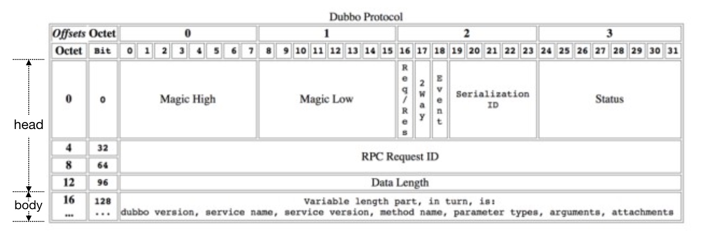

## 1. 简介
Dubbo 服务调用过程比较复杂，包含众多步骤，比如发送请求、编解码、服务降级、过滤器链处理、序列化、线程派发以及响应请求等步骤

## 2. 源码分析


* proxy0
* Wrapper0 

### 2.1 服务调用方式
* 同步 默认
* 异步 有返回值和无返回值

proxy0 

InvokerInvocationHandler 

MockClusterInvoker

FailoverClusterInvoker

DubboInvoker

DefaultFuture 

### 2.2 服务消费方发送请求

#### 2.2.1 发送请求

ExchangeClient 

ReferenceCountExchangeClient 
HeaderExchangeClient 
HeaderExchangeChannel 

NettyClient 
NettyChannel 


```
proxy0#sayHello(String)
  —> InvokerInvocationHandler#invoke(Object, Method, Object[])
    —> MockClusterInvoker#invoke(Invocation)
      —> AbstractClusterInvoker#invoke(Invocation)
        —> FailoverClusterInvoker#doInvoke(Invocation, List<Invoker<T>>, LoadBalance)
          —> Filter#invoke(Invoker, Invocation)  // 包含多个 Filter 调用
            —> ListenerInvokerWrapper#invoke(Invocation) 
              —> AbstractInvoker#invoke(Invocation) 
                —> DubboInvoker#doInvoke(Invocation)
                  —> ReferenceCountExchangeClient#request(Object, int)
                    —> HeaderExchangeClient#request(Object, int)
                      —> HeaderExchangeChannel#request(Object, int)
                        —> AbstractPeer#send(Object)
                          —> AbstractClient#send(Object, boolean)
                            —> NettyChannel#send(Object, boolean)
                              —> NioClientSocketChannel#write(Object)
```

#### 2.2.2 请求编码


Dubbo 数据包分为消息头和消息体
* 消息头用于存储一些元信息，比如魔数（Magic），数据包类型（Request/Response），消息体长度（Data Length）等。
* 消息体用于存储具体的调用消息，比如方法名称，参数列表等。

ExchangeCodec 

DubboCodec 


### 2.3 服务提供方接收请求

#### 2.3.1 请求解码
ExchangeCodec 

DubboCodec 

DecodeableRpcInvocation 

#### 2.3.2 调用服务

解码器将数据包解析成 Request 对象后，NettyHandler 的 messageReceived 方法紧接着会收到这个对象，并将这个对象继续向下传递。
这期间该对象会被依次传递给 NettyServer、MultiMessageHandler、HeartbeatHandler 以及 AllChannelHandler。
最后由 AllChannelHandler 将该对象封装到 Runnable 实现类对象中，并将 Runnable 放入线程池中执行后续的调用逻辑。整个调用栈如下：
```
NettyHandler#messageReceived(ChannelHandlerContext, MessageEvent)
  —> AbstractPeer#received(Channel, Object)
    —> MultiMessageHandler#received(Channel, Object)
      —> HeartbeatHandler#received(Channel, Object)
        —> AllChannelHandler#received(Channel, Object)
          —> ExecutorService#execute(Runnable)    // 由线程池执行后续的调用逻辑
```

##### 2.3.2.1 线程派发模型
Dubbo 将底层通信框架中接收请求的线程称为 IO 线程。
如果一些事件处理逻辑可以很快执行完，比如只在内存打一个标记，此时直接在 IO 线程上执行该段逻辑即可。
但如果事件的处理逻辑比较耗时，比如该段逻辑会发起数据库查询或者 HTTP 请求。
此时我们就不应该让事件处理逻辑在 IO 线程上执行，而是应该派发到线程池中去执行。


AllChannelHandler 


##### 2.3.2.2 调用服务
ChannelEventRunnable 

DecodeHandler 

HeaderExchangeHandler 

DubboProtocol 

JavassistProxyFactory 

Wrapper0 

```
ChannelEventRunnable#run()
  —> DecodeHandler#received(Channel, Object)
    —> HeaderExchangeHandler#received(Channel, Object)
      —> HeaderExchangeHandler#handleRequest(ExchangeChannel, Request)
        —> DubboProtocol.requestHandler#reply(ExchangeChannel, Object)
          —> Filter#invoke(Invoker, Invocation)
            —> AbstractProxyInvoker#invoke(Invocation)
              —> Wrapper0#invokeMethod(Object, String, Class[], Object[])
                —> DemoServiceImpl#sayHello(String)
```


### 2.4 服务提供方返回调用结果

ExchangeCodec 

DubboCodec 


### 2.5 服务消费方接收调用结果

#### 2.5.1 响应数据解码

DubboCodec 

DecodeableRpcResult 


#### 2.5.2 向用户线程传递调用结果

响应数据解码完成后，Dubbo 会将响应对象派发到线程池上。
要注意的是，线程池中的线程并非用户的调用线程，所以要想办法将响应对象从线程池线程传递到用户线程上。
我们在 2.1 节分析过用户线程在发送完请求后的动作，即调用 DefaultFuture 的 get 方法等待响应对象的到来。
当响应对象到来后，用户线程会被唤醒，并通过调用编号获取属于自己的响应对象。


HeaderExchangeHandler 

DefaultFuture 