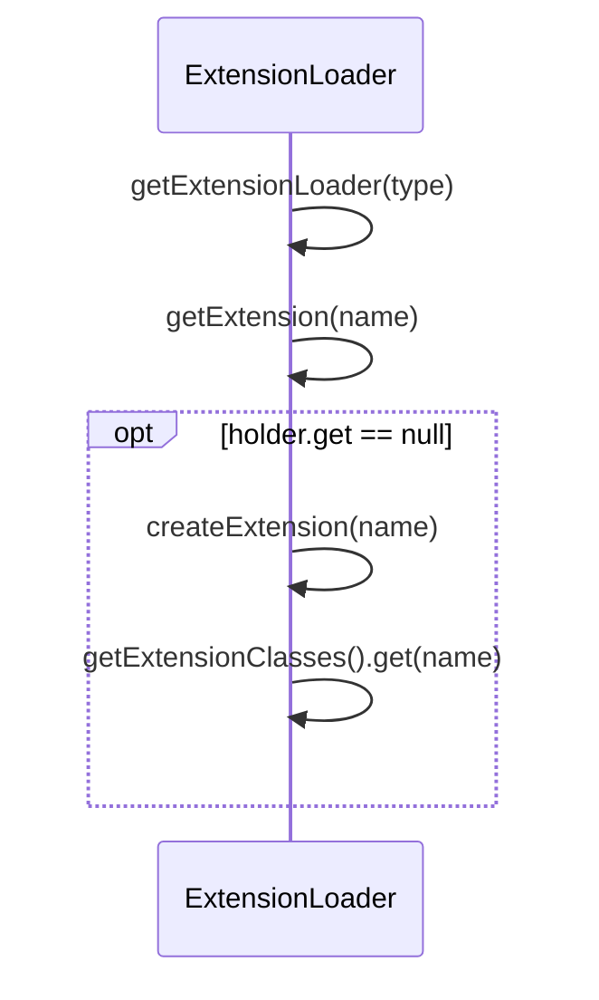

## ExtensionLoader

```mermaid
sequenceDiagram
    %% 从缓存中获取与拓展类对应的 ExtensionLoader，若缓存未命中，则创建
    ExtensionLoader->>ExtensionLoader: getExtensionLoader(type)
    
    %% 检查缓存，缓存未命中则创建拓展对象
    ExtensionLoader->>ExtensionLoader: getExtension(name)
    opt holder.get == null 
        ExtensionLoader->>ExtensionLoader: createExtension(name)

        ExtensionLoader->>ExtensionLoader: getExtensionClasses().get(name)
        
    end
```

