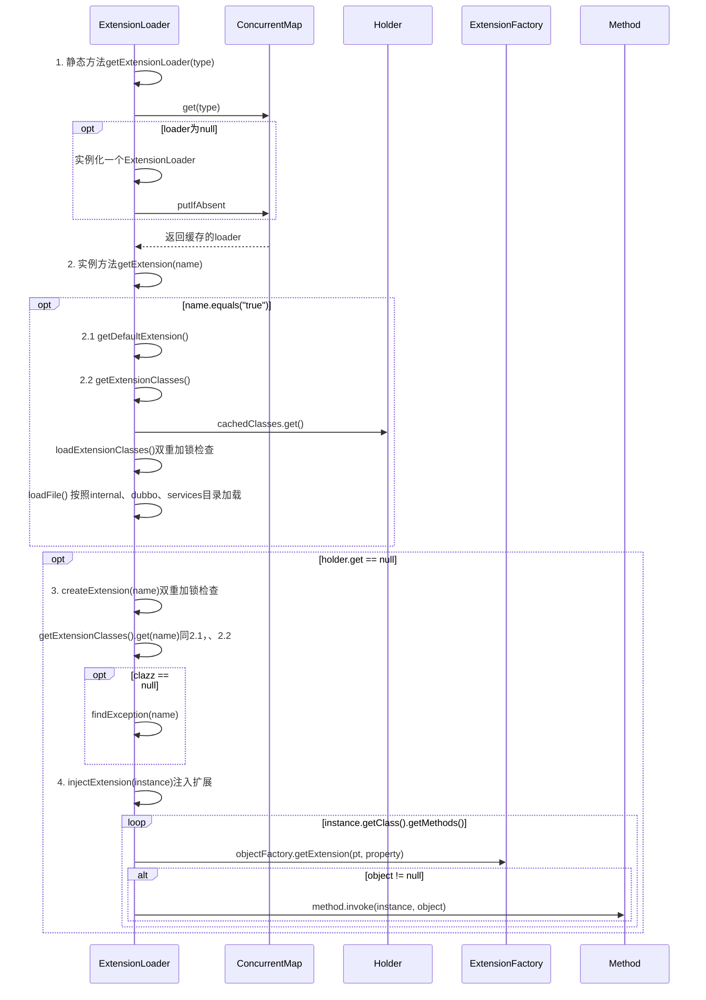

* getExtensionLoader()
* getAdaptiveExtension()

## 类图
使用了大量的ConcurrentMap容器，用作缓存
```yuml
// {type:class}

[ExtensionLoader]++-[ConcurrentMap<Class<?>, ExtensionLoader<?>>]
[ExtensionLoader]++-[ConcurrentMap<Class<?>, Object> ]

[ExtensionLoader]++-[ExtensionFactory]
[ExtensionLoader]++-[Holder<Map<String, Class<?>>>]

```

## getExtension()入口方法



