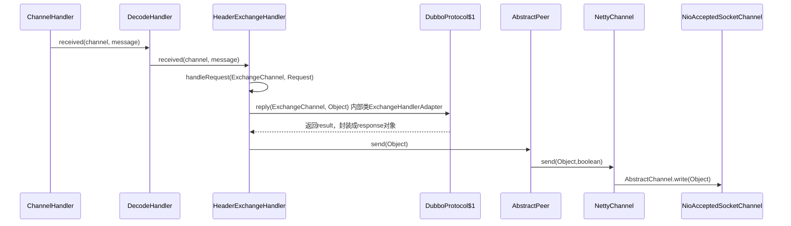

## 栈调用

### refer stack

```
java.lang.reflect.InvocationTargetException
	at sun.reflect.NativeMethodAccessorImpl.invoke0(Native Method)
	at sun.reflect.NativeMethodAccessorImpl.invoke(NativeMethodAccessorImpl.java:62)
	at sun.reflect.DelegatingMethodAccessorImpl.invoke(DelegatingMethodAccessorImpl.java:43)
	at java.lang.reflect.Method.invoke(Method.java:498)
	at com.weidai.ops.dubbo.tester.service.DubboReferenceService.invoke(DubboReferenceService.java:132)
	at com.weidai.ops.dubbo.tester.controller.IndexController.invoke(IndexController.java:58)
	at sun.reflect.NativeMethodAccessorImpl.invoke0(Native Method)
	at sun.reflect.NativeMethodAccessorImpl.invoke(NativeMethodAccessorImpl.java:62)
	at sun.reflect.DelegatingMethodAccessorImpl.invoke(DelegatingMethodAccessorImpl.java:43)
	at java.lang.reflect.Method.invoke(Method.java:498)
	at org.springframework.web.method.support.InvocableHandlerMethod.doInvoke(InvocableHandlerMethod.java:205)
	at org.springframework.web.method.support.InvocableHandlerMethod.invokeForRequest(InvocableHandlerMethod.java:133)
	at org.springframework.web.servlet.mvc.method.annotation.ServletInvocableHandlerMethod.invokeAndHandle(ServletInvocableHandlerMethod.java:97)
	at org.springframework.web.servlet.mvc.method.annotation.RequestMappingHandlerAdapter.invokeHandlerMethod(RequestMappingHandlerAdapter.java:827)
	at org.springframework.web.servlet.mvc.method.annotation.RequestMappingHandlerAdapter.handleInternal(RequestMappingHandlerAdapter.java:738)
	at org.springframework.web.servlet.mvc.method.AbstractHandlerMethodAdapter.handle(AbstractHandlerMethodAdapter.java:85)
	at org.springframework.web.servlet.DispatcherServlet.doDispatch(DispatcherServlet.java:967)
	at org.springframework.web.servlet.DispatcherServlet.doService(DispatcherServlet.java:901)
	at org.springframework.web.servlet.FrameworkServlet.processRequest(FrameworkServlet.java:970)
	at org.springframework.web.servlet.FrameworkServlet.doPost(FrameworkServlet.java:872)
	at javax.servlet.http.HttpServlet.service(HttpServlet.java:661)
	at org.springframework.web.servlet.FrameworkServlet.service(FrameworkServlet.java:846)
	at javax.servlet.http.HttpServlet.service(HttpServlet.java:742)
	at org.apache.catalina.core.ApplicationFilterChain.internalDoFilter(ApplicationFilterChain.java:231)
	at org.apache.catalina.core.ApplicationFilterChain.doFilter(ApplicationFilterChain.java:166)
	at org.apache.tomcat.websocket.server.WsFilter.doFilter(WsFilter.java:52)
	at org.apache.catalina.core.ApplicationFilterChain.internalDoFilter(ApplicationFilterChain.java:193)
	at org.apache.catalina.core.ApplicationFilterChain.doFilter(ApplicationFilterChain.java:166)
	at org.springframework.web.filter.RequestContextFilter.doFilterInternal(RequestContextFilter.java:99)
	at org.springframework.web.filter.OncePerRequestFilter.doFilter(OncePerRequestFilter.java:107)
	at org.apache.catalina.core.ApplicationFilterChain.internalDoFilter(ApplicationFilterChain.java:193)
	at org.apache.catalina.core.ApplicationFilterChain.doFilter(ApplicationFilterChain.java:166)
	at org.springframework.web.filter.HttpPutFormContentFilter.doFilterInternal(HttpPutFormContentFilter.java:108)
	at org.springframework.web.filter.OncePerRequestFilter.doFilter(OncePerRequestFilter.java:107)
	at org.apache.catalina.core.ApplicationFilterChain.internalDoFilter(ApplicationFilterChain.java:193)
	at org.apache.catalina.core.ApplicationFilterChain.doFilter(ApplicationFilterChain.java:166)
	at org.springframework.web.filter.HiddenHttpMethodFilter.doFilterInternal(HiddenHttpMethodFilter.java:81)
	at org.springframework.web.filter.OncePerRequestFilter.doFilter(OncePerRequestFilter.java:107)
	at org.apache.catalina.core.ApplicationFilterChain.internalDoFilter(ApplicationFilterChain.java:193)
	at org.apache.catalina.core.ApplicationFilterChain.doFilter(ApplicationFilterChain.java:166)
	at org.springframework.web.filter.CharacterEncodingFilter.doFilterInternal(CharacterEncodingFilter.java:197)
	at org.springframework.web.filter.OncePerRequestFilter.doFilter(OncePerRequestFilter.java:107)
	at org.apache.catalina.core.ApplicationFilterChain.internalDoFilter(ApplicationFilterChain.java:193)
	at org.apache.catalina.core.ApplicationFilterChain.doFilter(ApplicationFilterChain.java:166)
	at org.apache.catalina.core.StandardWrapperValve.invoke(StandardWrapperValve.java:199)
	at org.apache.catalina.core.StandardContextValve.invoke(StandardContextValve.java:96)
	at org.apache.catalina.authenticator.AuthenticatorBase.invoke(AuthenticatorBase.java:478)
	at org.apache.catalina.core.StandardHostValve.invoke(StandardHostValve.java:140)
	at org.apache.catalina.valves.ErrorReportValve.invoke(ErrorReportValve.java:81)
	at org.apache.catalina.core.StandardEngineValve.invoke(StandardEngineValve.java:87)
	at org.apache.catalina.connector.CoyoteAdapter.service(CoyoteAdapter.java:342)
	at org.apache.coyote.http11.Http11Processor.service(Http11Processor.java:803)
	at org.apache.coyote.AbstractProcessorLight.process(AbstractProcessorLight.java:66)
	at org.apache.coyote.AbstractProtocol$ConnectionHandler.process(AbstractProtocol.java:868)
	at org.apache.tomcat.util.net.NioEndpoint$SocketProcessor.doRun(NioEndpoint.java:1459)
	at org.apache.tomcat.util.net.SocketProcessorBase.run(SocketProcessorBase.java:49)
	at java.util.concurrent.ThreadPoolExecutor.runWorker(ThreadPoolExecutor.java:1149)
	at java.util.concurrent.ThreadPoolExecutor$Worker.run(ThreadPoolExecutor.java:624)
	at org.apache.tomcat.util.threads.TaskThread$WrappingRunnable.run(TaskThread.java:61)
	at java.lang.Thread.run(Thread.java:748)
Caused by: java.lang.IllegalArgumentException: [Assertion failed] - this argument is required; it must not be null
	at org.springframework.util.Assert.notNull(Assert.java:115)
	at org.springframework.util.Assert.notNull(Assert.java:126)
	at com.weidai.common.support.rpc.facade.impl.BaseRpcDataProviderFacadeImpl.findById(BaseRpcDataProviderFacadeImpl.java:198)
	at com.alibaba.dubbo.common.bytecode.Wrapper14.invokeMethod(Wrapper14.java)
	at com.alibaba.dubbo.rpc.proxy.javassist.JavassistProxyFactory$1.doInvoke(JavassistProxyFactory.java:46)
	at com.alibaba.dubbo.rpc.proxy.AbstractProxyInvoker.invoke(AbstractProxyInvoker.java:72)
	at com.alibaba.dubbo.rpc.protocol.InvokerWrapper.invoke(InvokerWrapper.java:53)
	at com.alibaba.dubbo.rpc.filter.ExceptionFilter.invoke(ExceptionFilter.java:64)
	at com.alibaba.dubbo.rpc.protocol.ProtocolFilterWrapper$1.invoke(ProtocolFilterWrapper.java:91)
	at com.alibaba.dubbo.rpc.filter.TimeoutFilter.invoke(TimeoutFilter.java:42)
	at com.alibaba.dubbo.rpc.protocol.ProtocolFilterWrapper$1.invoke(ProtocolFilterWrapper.java:91)
	at com.weidai.cat.plugin.dubbo.CatDubboFilter.invoke(CatDubboFilter.java:76)
	at com.alibaba.dubbo.rpc.protocol.ProtocolFilterWrapper$1.invoke(ProtocolFilterWrapper.java:91)
	at com.alibaba.dubbo.monitor.support.MonitorFilter.invoke(MonitorFilter.java:75)
	at com.alibaba.dubbo.rpc.protocol.ProtocolFilterWrapper$1.invoke(ProtocolFilterWrapper.java:91)
	at com.alibaba.dubbo.rpc.protocol.dubbo.filter.TraceFilter.invoke(TraceFilter.java:78)
	at com.alibaba.dubbo.rpc.protocol.ProtocolFilterWrapper$1.invoke(ProtocolFilterWrapper.java:91)
	at com.alibaba.dubbo.rpc.filter.ContextFilter.invoke(ContextFilter.java:60)
	at com.alibaba.dubbo.rpc.protocol.ProtocolFilterWrapper$1.invoke(ProtocolFilterWrapper.java:91)
	at com.alibaba.dubbo.rpc.filter.GenericFilter.invoke(GenericFilter.java:112)
	at com.alibaba.dubbo.rpc.protocol.ProtocolFilterWrapper$1.invoke(ProtocolFilterWrapper.java:91)
	at com.alibaba.dubbo.rpc.filter.ClassLoaderFilter.invoke(ClassLoaderFilter.java:38)
	at com.alibaba.dubbo.rpc.protocol.ProtocolFilterWrapper$1.invoke(ProtocolFilterWrapper.java:91)
	at com.alibaba.dubbo.rpc.filter.EchoFilter.invoke(EchoFilter.java:38)
	at com.alibaba.dubbo.rpc.protocol.ProtocolFilterWrapper$1.invoke(ProtocolFilterWrapper.java:91)
	at com.alibaba.dubbo.rpc.protocol.dubbo.DubboProtocol$1.reply(DubboProtocol.java:108)
	at com.alibaba.dubbo.remoting.exchange.support.header.HeaderExchangeHandler.handleRequest(HeaderExchangeHandler.java:84)
	at com.alibaba.dubbo.remoting.exchange.support.header.HeaderExchangeHandler.received(HeaderExchangeHandler.java:170)
	at com.alibaba.dubbo.remoting.transport.DecodeHandler.received(DecodeHandler.java:52)
	at com.alibaba.dubbo.remoting.transport.dispatcher.ChannelEventRunnable.run(ChannelEventRunnable.java:82)
	at java.util.concurrent.ThreadPoolExecutor.runWorker(ThreadPoolExecutor.java:1145)
	at java.util.concurrent.ThreadPoolExecutor$Worker.run(ThreadPoolExecutor.java:615)
	at java.lang.Thread.run(Thread.java:745)
```

### server stack

```
Daemon Thread [DubboServerHandler-192.168.2.252:18177-thread-5] (Suspended (breakpoint at line 198 in BaseRpcDataProviderFacadeImpl))	

    // 服务实现
	ActivityRecordLogFacadeImpl(BaseRpcDataProviderFacadeImpl<U,Q,T>).findById(Integer) line: 198	
	Wrapper14.invokeMethod(Object, String, Class[], Object[]) line: not available	
	
	// 动态代理
	JavassistProxyFactory$1.doInvoke(T, String, Class<?>[], Object[]) line: 46	
	JavassistProxyFactory$1(AbstractProxyInvoker<T>).invoke(Invocation) line: 72	
	
	// 注册协议
	RegistryProtocol$InvokerDelegete<T>(InvokerWrapper<T>).invoke(Invocation) line: 53	
	
	// 过滤器链
	// 异常过滤
	ExceptionFilter.invoke(Invoker<?>, Invocation) line: 64	
	ProtocolFilterWrapper$1.invoke(Invocation) line: 91	
	// 超时过滤
	TimeoutFilter.invoke(Invoker<?>, Invocation) line: 42	
	ProtocolFilterWrapper$1.invoke(Invocation) line: 91	
	// cat过滤
	CatDubboFilter.invoke(Invoker<?>, Invocation) line: 76	
	ProtocolFilterWrapper$1.invoke(Invocation) line: 91	
	// 监控过滤
	MonitorFilter.invoke(Invoker<?>, Invocation) line: 75	
	ProtocolFilterWrapper$1.invoke(Invocation) line: 91	
	// 链路过滤 链路跟踪、链路压测
	TraceFilter.invoke(Invoker<?>, Invocation) line: 78	
	ProtocolFilterWrapper$1.invoke(Invocation) line: 91	
	// 上下文过滤
	ContextFilter.invoke(Invoker<?>, Invocation) line: 60	
	ProtocolFilterWrapper$1.invoke(Invocation) line: 91	
	// 通用过滤
	GenericFilter.invoke(Invoker<?>, Invocation) line: 112	
	ProtocolFilterWrapper$1.invoke(Invocation) line: 91	
	// 类加载器过滤
	ClassLoaderFilter.invoke(Invoker<?>, Invocation) line: 38	
	ProtocolFilterWrapper$1.invoke(Invocation) line: 91	
	// 回声过滤
	EchoFilter.invoke(Invoker<?>, Invocation) line: 38	
	ProtocolFilterWrapper$1.invoke(Invocation) line: 91	
	
	// dubbo传输协议处理
	DubboProtocol$1.reply(ExchangeChannel, Object) line: 108	
	
	// 传输层处理
	HeaderExchangeHandler.handleRequest(ExchangeChannel, Request) line: 84	
	HeaderExchangeHandler.received(Channel, Object) line: 170	
	DecodeHandler.received(Channel, Object) line: 52	
	ChannelEventRunnable.run() line: 82	
	
	// 线程池
	ThreadPoolExecutor.runWorker(ThreadPoolExecutor$Worker) line: 1145	
	ThreadPoolExecutor$Worker.run() line: 615 [local variables unavailable]	
	Thread.run() line: 745 [local variables unavailable]	
```

## sequence

