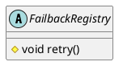

com.alibaba.dubbo.registry.support.FailbackRegistry

* ScheduledExecutorService 
* ScheduledFuture
* ConcurrentHashSet
* ConcurrentHashMap
* 模板方法模式

## hierarchy
```
AbstractRegistry (com.alibaba.dubbo.registry.support)
    FailbackRegistry (com.alibaba.dubbo.registry.support)
        DubboRegistry (com.alibaba.dubbo.registry.dubbo)
        MulticastRegistry (com.alibaba.dubbo.registry.multicast)
        RedisRegistry (com.alibaba.dubbo.registry.redis)
        ZookeeperRegistry (com.alibaba.dubbo.registry.zookeeper)
```

## define
* 失败重试



## methods

### modoRegister doUnregister doSubscribe doUnsubscribe
模板方法模式


## links
scheduleWithFixedDelay 比如当前一个任务结束的时刻，开始结算间隔时间，如0秒开始执行第一次任务，任务耗时5秒，任务间隔时间3秒，那么第二次任务执行的时间是在第8秒开始。