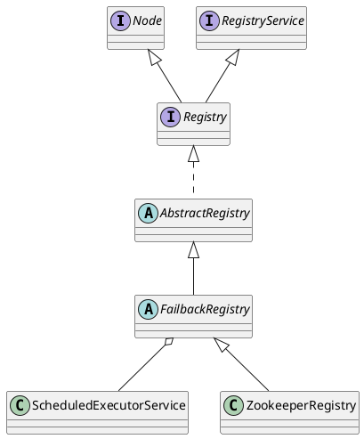

com.alibaba.dubbo.registry.zookeeper.ZookeeperRegistry

* ConcurrentMap<URL, ConcurrentMap<NotifyListener, ChildListener>>

## hierarchy
```
AbstractRegistry (com.alibaba.dubbo.registry.support) -.-^ Registry
    FailbackRegistry (com.alibaba.dubbo.registry.support)
        ZookeeperRegistry (com.alibaba.dubbo.registry.zookeeper)
ZookeeperRegistry (com.alibaba.dubbo.registry.zookeeper)
    FailbackRegistry (com.alibaba.dubbo.registry.support)
        AbstractRegistry (com.alibaba.dubbo.registry.support)
        Object (java.lang)
        Registry (com.alibaba.dubbo.registry)
            Node (com.alibaba.dubbo.common)
            RegistryService (com.alibaba.dubbo.registry)
```

## define
